# Authentication and Email Infrastructure

> JWT authentication and email service setup for SwapJoys Platform MVP

---

## 📊 Authentication Flow Diagram

```mermaid
flowchart TB
    subgraph REGISTER["Company Registration Flow"]
        R1[Registration Form] --> R2[Validate Input]
        R2 --> R3[Create Company]
        R3 --> R4[Create Owner User]
        R4 --> R5[Add 50 Welcome Points]
        R5 --> R6[Generate Verification Token]
        R6 --> R7[Send Verification Email]
        R7 --> R8[User Clicks Link]
        R8 --> R9[Verify Token]
        R9 --> R10[Mark Email Verified]
        R10 --> R11[Redirect to Login]
    end
    
    subgraph LOGIN["Login Flow"]
        L1[Login Form] --> L2[Validate Credentials]
        L2 -->|Invalid| L3[Return Error]
        L2 -->|Valid| L4{Email Verified?}
        L4 -->|No| L5[Resend Verification]
        L4 -->|Yes| L6[Generate JWT Token]
        L6 --> L7[Return Token + User Data]
        L7 --> L8[Store Token in Frontend]
        L8 --> L9[Redirect to Dashboard]
    end
    
    subgraph PASSWORD["Password Reset Flow"]
        P1[Forgot Password Form] --> P2[Validate Email]
        P2 -->|Not Found| P3[Return Error]
        P2 -->|Found| P4[Generate Reset Token]
        P4 --> P5[Send Reset Email]
        P5 --> P6[User Clicks Link]
        P6 --> P7[Reset Password Form]
        P7 --> P8[Validate Token]
        P8 -->|Invalid/Expired| P9[Return Error]
        P8 -->|Valid| P10[Update Password]
        P10 --> P11[Delete Token]
        P11 --> P12[Redirect to Login]
    end
    
    subgraph INVITE["Employee Invitation Flow"]
        I1[Add Employee Form] --> I2[Create User Record]
        I2 --> I3[Generate Invitation Token]
        I3 --> I4[Send Invitation Email]
        I4 --> I5[Employee Clicks Link]
        I5 --> I6[Set Password Form]
        I6 --> I7[Validate Token]
        I7 --> I8[Set Password]
        I8 --> I9[Activate Account]
        I9 --> I10[Redirect to Login]
    end
```



---

## Overview

| | |
|---|---|
| **Authentication** | JWT (JSON Web Token) |
| **Library** | Laravel Sanctum |
| **Token Expiry** | 60 minutes (configurable) |
| **Email Service** | SMTP (Mailgun/SendGrid ready) |
| **Status** | ✅ Foundation Complete |

---

## Authentication System

### JWT Token Structure

```
Header.Payload.Signature

Header: { "alg": "HS256", "typ": "JWT" }
Payload: { "sub": user_id, "company_id": company_id, "role": role_slug, "exp": expiry }
Signature: HMACSHA256(header + payload, secret)
```

### Token Lifecycle

| Action | Description |
|--------|-------------|
| **Generation** | On successful login |
| **Storage** | Frontend localStorage/cookie |
| **Validation** | Every API request via middleware |
| **Refresh** | Before expiry (optional) |
| **Revocation** | On logout |

---

## Authentication Endpoints

### Registration
| | |
|---|---|
| **Endpoint** | `POST /api/register` |
| **Body** | email, password, company_name, org_number, address, city |
| **Response** | Success message, verification email sent |

### Login
| | |
|---|---|
| **Endpoint** | `POST /api/login` |
| **Body** | email, password |
| **Response** | JWT token, user data, company data |

### Logout
| | |
|---|---|
| **Endpoint** | `POST /api/logout` |
| **Headers** | Authorization: Bearer {token} |
| **Response** | Success message, token revoked |

### Email Verification
| | |
|---|---|
| **Endpoint** | `GET /api/verify-email/{token}` |
| **Response** | Email verified, redirect to login |

### Resend Verification
| | |
|---|---|
| **Endpoint** | `POST /api/resend-verification` |
| **Body** | email |
| **Response** | Verification email sent |

### Forgot Password
| | |
|---|---|
| **Endpoint** | `POST /api/password/forgot` |
| **Body** | email |
| **Response** | Reset email sent |

### Reset Password
| | |
|---|---|
| **Endpoint** | `POST /api/password/reset` |
| **Body** | token, email, password, password_confirmation |
| **Response** | Password updated, redirect to login |

---

## Role-Based Access Control (RBAC)

### Roles

| Role | Slug | Access Level |
|------|------|--------------|
| Owner | `owner` | Full access - billing, settings, all features |
| Manager | `manager` | Manage employees, experiences, view reports |
| Employee | `employee` | View experiences, use tickets only |

### Middleware Implementation

```
Route::middleware(['auth:sanctum', 'role:owner'])->group(function () {
    // Owner-only routes
});

Route::middleware(['auth:sanctum', 'role:owner,manager'])->group(function () {
    // Owner and Manager routes
});

Route::middleware(['auth:sanctum'])->group(function () {
    // All authenticated users
});
```

### Permission Matrix

| Feature | Owner | Manager | Employee |
|---------|-------|---------|----------|
| View Dashboard | ✅ | ✅ | ✅ |
| Manage Company Profile | ✅ | ❌ | ❌ |
| Add/Edit Employees | ✅ | ✅ | ❌ |
| Create Experiences | ✅ | ✅ | ❌ |
| Approve Bookings | ✅ | ✅ | ❌ |
| View Marketplace | ✅ | ✅ | ✅ |
| Use Tickets | ✅ | ✅ | ✅ |
| View Points Balance | ✅ | ✅ | ✅ |
| View Transactions | ✅ | ✅ | ❌ |
| Tax Reports | ✅ | ❌ | ❌ |
| Subscription Management | ✅ | ❌ | ❌ |

---

## Email Infrastructure

### Email Service Configuration

```env
MAIL_MAILER=smtp
MAIL_HOST=smtp.mailgun.org
MAIL_PORT=587
MAIL_USERNAME=your-username
MAIL_PASSWORD=your-password
MAIL_ENCRYPTION=tls
MAIL_FROM_ADDRESS=noreply@swapjoys.com
MAIL_FROM_NAME="SwapJoys"
```

### Email Templates

| Email | Trigger | Content |
|-------|---------|---------|
| Verification Email | Company registration | Verify email link |
| Welcome Email | Email verified | Welcome + 50 points info |
| Password Reset | Forgot password request | Reset password link |
| Employee Invitation | Employee added | Set password link |
| Booking Request | New booking request | Request details to host |
| Booking Approved | Host approves | Ticket + QR code |
| Booking Rejected | Host rejects | Rejection reason |
| Threshold Warning | Near NOK 5,000 | Tax warning notification |

---

## Email Template Designs

### 1. Verification Email

```
Subject: Verify your SwapJoys account

━━━━━━━━━━━━━━━━━━━━━━━━━━━━━━━━━━━━

   [SwapJoys Logo]

━━━━━━━━━━━━━━━━━━━━━━━━━━━━━━━━━━━━

Hi {company_name},

Welcome to SwapJoys! Please verify your email address 
to complete your registration.

        [Verify Email Button]

This link will expire in 24 hours.

If you didn't create this account, please ignore this email.

━━━━━━━━━━━━━━━━━━━━━━━━━━━━━━━━━━━━
© 2026 SwapJoys. All rights reserved.
```

### 2. Password Reset Email

```
Subject: Reset your SwapJoys password

━━━━━━━━━━━━━━━━━━━━━━━━━━━━━━━━━━━━

   [SwapJoys Logo]

━━━━━━━━━━━━━━━━━━━━━━━━━━━━━━━━━━━━

Hi {user_name},

We received a request to reset your password.

        [Reset Password Button]

This link will expire in 1 hour.

If you didn't request this, please ignore this email.

━━━━━━━━━━━━━━━━━━━━━━━━━━━━━━━━━━━━
© 2026 SwapJoys. All rights reserved.
```

### 3. Employee Invitation Email

```
Subject: You're invited to join {company_name} on SwapJoys

━━━━━━━━━━━━━━━━━━━━━━━━━━━━━━━━━━━━

   [SwapJoys Logo]

━━━━━━━━━━━━━━━━━━━━━━━━━━━━━━━━━━━━

Hi {employee_name},

{company_name} has invited you to join SwapJoys - 
an employee experience exchange platform.

        [Accept Invitation Button]

This link will expire in 7 days.

━━━━━━━━━━━━━━━━━━━━━━━━━━━━━━━━━━━━
© 2026 SwapJoys. All rights reserved.
```

### 4. Booking Approved Email (with Ticket)

```
Subject: Your booking is confirmed! 🎉

━━━━━━━━━━━━━━━━━━━━━━━━━━━━━━━━━━━━

   [SwapJoys Logo]

━━━━━━━━━━━━━━━━━━━━━━━━━━━━━━━━━━━━

Hi {employee_name},

Great news! Your experience booking has been approved.

━━━━━━━━━━━━━━━━━━━━━━━━━━━━━━━━━━━━
EXPERIENCE: {experience_title}
DATE: {booking_date}
HOST: {host_company_name}
━━━━━━━━━━━━━━━━━━━━━━━━━━━━━━━━━━━━

YOUR TICKET:

        [QR Code Image]

Backup Code: {backup_code}

Show this QR code or backup code to the host 
when you arrive.

        [View Ticket Button]

━━━━━━━━━━━━━━━━━━━━━━━━━━━━━━━━━━━━
© 2026 SwapJoys. All rights reserved.
```

---

## Security Measures

| Measure | Implementation |
|---------|----------------|
| Password Hashing | bcrypt (cost factor 12) |
| Token Security | HMAC-SHA256 signed |
| Token Expiry | 60 minutes default |
| Rate Limiting | 5 attempts per minute (login) |
| HTTPS | Required for all endpoints |
| CORS | Configured for frontend domain |
| XSS Protection | Input sanitization |
| CSRF Protection | Token-based (Sanctum) |

---

## Token Validation Middleware

```
Request → Check Authorization Header → Extract Token → 
Validate Signature → Check Expiry → Verify User Exists → 
Check Email Verified → Check Subscription Active → Allow Request
```

---

## Database Tables

### password_resets
| Column | Type | Description |
|--------|------|-------------|
| email | VARCHAR(255) | User email (PK) |
| token | VARCHAR(255) | Hashed reset token |
| created_at | TIMESTAMP | Token creation time |

### email_verifications
| Column | Type | Description |
|--------|------|-------------|
| id | INT | Primary key |
| user_id | INT (FK) | User to verify |
| token | VARCHAR(255) | Verification token |
| expires_at | TIMESTAMP | Token expiry |
| created_at | TIMESTAMP | Creation time |

### personal_access_tokens (Sanctum)
| Column | Type | Description |
|--------|------|-------------|
| id | INT | Primary key |
| tokenable_type | VARCHAR | User model |
| tokenable_id | INT | User ID |
| name | VARCHAR | Token name |
| token | VARCHAR(64) | Hashed token |
| abilities | TEXT | Token permissions |
| last_used_at | TIMESTAMP | Last activity |
| expires_at | TIMESTAMP | Expiry time |
| created_at | TIMESTAMP | Creation time |

---

## Status

| Component | Status |
|-----------|--------|
| JWT Setup (Sanctum) | ✅ Complete |
| Login / Logout | ✅ Complete |
| Registration Flow | ✅ Complete |
| Email Verification | ✅ Complete |
| Password Reset | ✅ Complete |
| Employee Invitation | ✅ Complete |
| Role-Based Access Control | ✅ Complete |
| Email Service Config | ✅ Complete |
| Email Templates Design | ✅ Complete |
| Security Measures | ✅ Complete |

---

**Prepared by:** Rebing Tech  
**Project:** SwapJoys Platform MVP  
**Milestone:** 1 of 8
