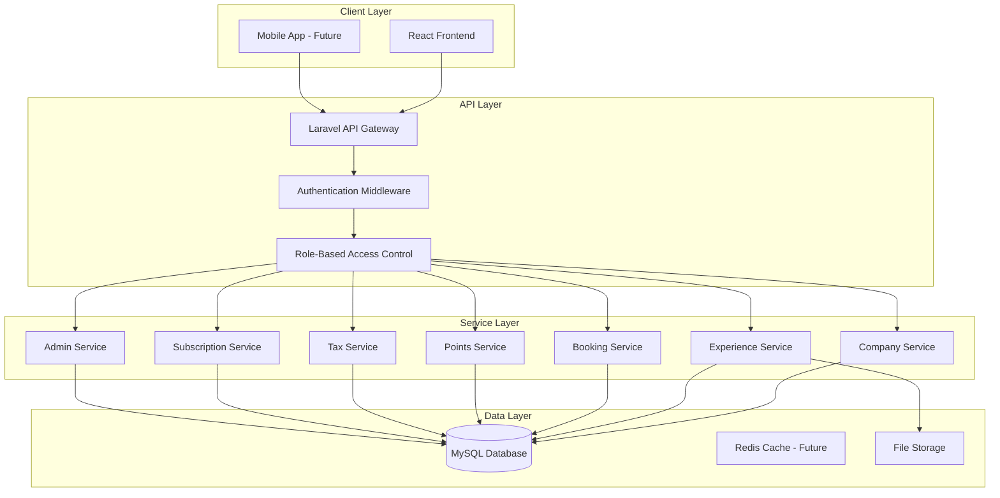

# Backend Service Foundation

> Laravel backend architecture for SwapJoys Platform MVP

---

## 📊 Architecture Diagram



```
┌─────────────────────────────────────────────────────────────────────────────────────────┐
│                                    CLIENT LAYER                                          │
├─────────────────────────────────────────────────────────────────────────────────────────┤
│                                                                                          │
│         ┌─────────────────────┐              ┌─────────────────────┐                    │
│         │   React Frontend    │              │ Mobile App - Future │                    │
│         └──────────┬──────────┘              └──────────┬──────────┘                    │
│                    │                                    │                               │
└────────────────────┼────────────────────────────────────┼───────────────────────────────┘
                     │                                    │
                     └──────────────┬─────────────────────┘
                                    │
                                    ▼
┌─────────────────────────────────────────────────────────────────────────────────────────┐
│                                     API LAYER                                            │
├─────────────────────────────────────────────────────────────────────────────────────────┤
│                                                                                          │
│                          ┌─────────────────────────┐                                    │
│                          │   Laravel API Gateway   │                                    │
│                          └────────────┬────────────┘                                    │
│                                       │                                                  │
│                                       ▼                                                  │
│                          ┌─────────────────────────┐                                    │
│                          │ Authentication Middleware│                                    │
│                          └────────────┬────────────┘                                    │
│                                       │                                                  │
│                                       ▼                                                  │
│                          ┌─────────────────────────┐                                    │
│                          │ Role-Based Access Control│                                    │
│                          └────────────┬────────────┘                                    │
│                                       │                                                  │
└───────────────────────────────────────┼─────────────────────────────────────────────────┘
                                        │
          ┌─────────┬─────────┬─────────┼─────────┬─────────┬─────────┐
          │         │         │         │         │         │         │
          ▼         ▼         ▼         ▼         ▼         ▼         ▼
┌─────────────────────────────────────────────────────────────────────────────────────────┐
│                                   SERVICE LAYER                                          │
├─────────────────────────────────────────────────────────────────────────────────────────┤
│                                                                                          │
│  ┌─────────┐ ┌───────────┐ ┌─────────┐ ┌────────┐ ┌────────┐ ┌────────────┐ ┌────────┐ │
│  │ Company │ │Experience │ │ Booking │ │ Points │ │  Tax   │ │Subscription│ │ Admin  │ │
│  │ Service │ │  Service  │ │ Service │ │ Service│ │ Service│ │  Service   │ │ Service│ │
│  └────┬────┘ └─────┬─────┘ └────┬────┘ └───┬────┘ └───┬────┘ └─────┬──────┘ └───┬────┘ │
│       │            │            │          │          │            │            │       │
└───────┼────────────┼────────────┼──────────┼──────────┼────────────┼────────────┼───────┘
        │            │            │          │          │            │            │
        │            │            │          │          │            │            │
        └────────────┴────────────┴──────────┼──────────┴────────────┴────────────┘
                                             │
                                             ▼
┌─────────────────────────────────────────────────────────────────────────────────────────┐
│                                    DATA LAYER                                            │
├─────────────────────────────────────────────────────────────────────────────────────────┤
│                                                                                          │
│      ┌─────────────────┐      ┌─────────────────────┐      ┌─────────────────┐          │
│      │                 │      │                     │      │                 │          │
│      │  MySQL Database │      │ Redis Cache - Future│      │  File Storage   │          │
│      │       (DB)      │      │                     │      │    (Photos)     │          │
│      │                 │      │                     │      │                 │          │
│      └─────────────────┘      └─────────────────────┘      └─────────────────┘          │
│                                                                                          │
└─────────────────────────────────────────────────────────────────────────────────────────┘
```

---

## Layer Details

### Client Layer

```
┌─────────────────────────────────────────┐
│            CLIENT LAYER                 │
├─────────────────────────────────────────┤
│                                         │
│  ┌─────────────────────┐                │
│  │   React Frontend    │ ◄── Current    │
│  └─────────────────────┘                │
│                                         │
│  ┌─────────────────────┐                │
│  │ Mobile App - Future │ ◄── Planned    │
│  └─────────────────────┘                │
│                                         │
└─────────────────────────────────────────┘
```

### API Layer

```
┌─────────────────────────────────────────┐
│              API LAYER                  │
├─────────────────────────────────────────┤
│                                         │
│  ┌─────────────────────┐                │
│  │ Laravel API Gateway │                │
│  └──────────┬──────────┘                │
│             │                           │
│             ▼                           │
│  ┌─────────────────────┐                │
│  │   Authentication    │                │
│  │     Middleware      │                │
│  └──────────┬──────────┘                │
│             │                           │
│             ▼                           │
│  ┌─────────────────────┐                │
│  │    Role-Based       │                │
│  │   Access Control    │                │
│  └─────────────────────┘                │
│                                         │
└─────────────────────────────────────────┘
```

### Service Layer

```
┌───────────────────────────────────────────────────────────────────┐
│                        SERVICE LAYER                              │
├───────────────────────────────────────────────────────────────────┤
│                                                                   │
│  ┌─────────────┐    ┌─────────────┐    ┌─────────────┐           │
│  │   Company   │    │ Experience  │    │   Booking   │           │
│  │   Service   │    │   Service   │    │   Service   │           │
│  └─────────────┘    └─────────────┘    └─────────────┘           │
│                                                                   │
│  ┌─────────────┐    ┌─────────────┐    ┌─────────────┐           │
│  │   Points    │    │     Tax     │    │Subscription │           │
│  │   Service   │    │   Service   │    │   Service   │           │
│  └─────────────┘    └─────────────┘    └─────────────┘           │
│                                                                   │
│  ┌─────────────┐                                                  │
│  │    Admin    │                                                  │
│  │   Service   │                                                  │
│  └─────────────┘                                                  │
│                                                                   │
└───────────────────────────────────────────────────────────────────┘
```

### Data Layer

```
┌───────────────────────────────────────────────────────────────────┐
│                         DATA LAYER                                │
├───────────────────────────────────────────────────────────────────┤
│                                                                   │
│  ┌─────────────────┐                                              │
│  │      MySQL      │ ◄── Primary Database                        │
│  │    Database     │     All application data                    │
│  └─────────────────┘                                              │
│                                                                   │
│  ┌─────────────────┐                                              │
│  │   Redis Cache   │ ◄── Future Implementation                   │
│  │    (Future)     │     Session & cache storage                 │
│  └─────────────────┘                                              │
│                                                                   │
│  ┌─────────────────┐                                              │
│  │  File Storage   │ ◄── Experience photos                       │
│  │                 │     Document uploads                        │
│  └─────────────────┘                                              │
│                                                                   │
└───────────────────────────────────────────────────────────────────┘
```

---

## Request Flow

```
┌──────────┐      ┌──────────┐      ┌──────────┐      ┌──────────┐      ┌──────────┐
│  React   │      │  Laravel │      │   Auth   │      │   RBAC   │      │ Service  │
│ Frontend │─────▶│    API   │─────▶│Middleware│─────▶│  Check   │─────▶│  Layer   │
└──────────┘      └──────────┘      └──────────┘      └──────────┘      └────┬─────┘
                                                                              │
                                                                              ▼
┌──────────┐      ┌──────────┐      ┌──────────┐      ┌──────────┐      ┌──────────┐
│  React   │      │  Laravel │      │  Format  │      │ Business │      │  MySQL   │
│ Frontend │◀─────│    API   │◀─────│ Response │◀─────│  Logic   │◀─────│ Database │
└──────────┘      └──────────┘      └──────────┘      └──────────┘      └──────────┘
```

---

## Services Summary

| Service | Responsibility |
|---------|----------------|
| Company Service | Company CRUD, profile management |
| Experience Service | Create, update, list, filter experiences |
| Booking Service | Request, approve, reject bookings |
| Points Service | Balance calculation, transactions, ledger |
| Tax Service | Usage logs, yearly summary, CSV export |
| Subscription Service | Subscription status, invoice management |
| Admin Service | Company management, point adjustments, logs |
---

## Overview

| | |
|---|---|
| **Framework** | Laravel 10.x |
| **PHP Version** | 8.1+ |
| **API Type** | RESTful JSON API |
| **Authentication** | JWT (Laravel Sanctum) |
| **Status** | ✅ Foundation Complete |

---

## Project Structure

```
swapjoys-backend/
├── app/
│   ├── Http/
│   │   ├── Controllers/
│   │   │   ├── Api/
│   │   │   │   ├── AuthController.php
│   │   │   │   ├── CompanyController.php
│   │   │   │   ├── UserController.php
│   │   │   │   ├── ExperienceController.php
│   │   │   │   ├── BookingController.php
│   │   │   │   ├── TicketController.php
│   │   │   │   ├── PointsController.php
│   │   │   │   ├── SubscriptionController.php
│   │   │   │   └── TaxController.php
│   │   │   └── Admin/
│   │   │       ├── AdminAuthController.php
│   │   │       ├── AdminCompanyController.php
│   │   │       └── AdminPointsController.php
│   │   ├── Middleware/
│   │   │   ├── JwtMiddleware.php
│   │   │   ├── RoleMiddleware.php
│   │   │   └── SubscriptionMiddleware.php
│   │   └── Requests/
│   │       ├── CompanyRequest.php
│   │       ├── ExperienceRequest.php
│   │       └── BookingRequest.php
│   ├── Models/
│   │   ├── Company.php
│   │   ├── User.php
│   │   ├── Role.php
│   │   ├── Experience.php
│   │   ├── Category.php
│   │   ├── City.php
│   │   ├── Booking.php
│   │   ├── Ticket.php
│   │   ├── PointsLedger.php
│   │   ├── Transaction.php
│   │   ├── UsageLog.php
│   │   ├── EmployeeYearlySummary.php
│   │   ├── Subscription.php
│   │   ├── Invoice.php
│   │   ├── AdminUser.php
│   │   ├── AdminLog.php
│   │   └── PointAdjustment.php
│   └── Services/
│       ├── AuthService.php
│       ├── CompanyService.php
│       ├── ExperienceService.php
│       ├── BookingService.php
│       ├── PointsService.php
│       ├── QrCodeService.php
│       ├── TaxService.php
│       └── SubscriptionService.php
├── config/
│   ├── app.php
│   ├── auth.php
│   ├── database.php
│   ├── sanctum.php
│   └── mail.php
├── database/
│   ├── migrations/
│   │   ├── create_companies_table.php
│   │   ├── create_users_table.php
│   │   ├── create_roles_table.php
│   │   ├── create_experiences_table.php
│   │   ├── create_categories_table.php
│   │   ├── create_cities_table.php
│   │   ├── create_bookings_table.php
│   │   ├── create_tickets_table.php
│   │   ├── create_points_ledger_table.php
│   │   ├── create_transactions_table.php
│   │   ├── create_usage_logs_table.php
│   │   ├── create_employee_yearly_summaries_table.php
│   │   ├── create_subscriptions_table.php
│   │   ├── create_invoices_table.php
│   │   ├── create_admin_users_table.php
│   │   ├── create_admin_logs_table.php
│   │   └── create_point_adjustments_table.php
│   └── seeders/
│       ├── RoleSeeder.php
│       ├── CategorySeeder.php
│       └── CitySeeder.php
├── routes/
│   ├── api.php
│   └── admin.php
├── .env.example
└── composer.json
```

---

## API Route Structure

### Public Routes
| Method | Endpoint | Description |
|--------|----------|-------------|
| POST | `/api/register` | Company registration |
| POST | `/api/login` | User login |
| POST | `/api/password/reset` | Password reset request |
| GET | `/api/verify-email/{token}` | Email verification |

### Protected Routes (Requires Auth)
| Method | Endpoint | Description |
|--------|----------|-------------|
| GET | `/api/profile` | Get user profile |
| PUT | `/api/profile` | Update profile |
| GET | `/api/company` | Get company details |
| PUT | `/api/company` | Update company |

### Employee Routes
| Method | Endpoint | Description |
|--------|----------|-------------|
| GET | `/api/employees` | List employees |
| POST | `/api/employees` | Add employee |
| PUT | `/api/employees/{id}` | Update employee |
| POST | `/api/employees/{id}/invite` | Send invitation |

### Experience Routes
| Method | Endpoint | Description |
|--------|----------|-------------|
| GET | `/api/experiences` | List marketplace |
| GET | `/api/experiences/{id}` | Experience detail |
| POST | `/api/experiences` | Create experience |
| PUT | `/api/experiences/{id}` | Update experience |

### Booking Routes
| Method | Endpoint | Description |
|--------|----------|-------------|
| POST | `/api/bookings` | Request booking |
| GET | `/api/bookings` | List bookings |
| PUT | `/api/bookings/{id}/approve` | Approve booking |
| PUT | `/api/bookings/{id}/reject` | Reject booking |

### Ticket Routes
| Method | Endpoint | Description |
|--------|----------|-------------|
| GET | `/api/tickets` | List tickets |
| GET | `/api/tickets/{id}` | Ticket detail with QR |
| POST | `/api/tickets/verify` | Verify & redeem ticket |

### Points Routes
| Method | Endpoint | Description |
|--------|----------|-------------|
| GET | `/api/points/balance` | Get balance |
| GET | `/api/points/transactions` | Transaction history |

### Tax Routes
| Method | Endpoint | Description |
|--------|----------|-------------|
| GET | `/api/tax/usage-logs` | Usage logs |
| GET | `/api/tax/yearly-summary` | Yearly summary |
| GET | `/api/tax/export` | CSV export |

### Admin Routes
| Method | Endpoint | Description |
|--------|----------|-------------|
| POST | `/api/admin/login` | Admin login |
| GET | `/api/admin/companies` | List companies |
| POST | `/api/admin/points/adjust` | Adjust points |
| GET | `/api/admin/logs` | Activity logs |

---

## Environment Configuration

### .env.example
```env
APP_NAME=SwapJoys
APP_ENV=local
APP_DEBUG=true
APP_URL=http://localhost

DB_CONNECTION=mysql
DB_HOST=127.0.0.1
DB_PORT=3306
DB_DATABASE=swapjoys
DB_USERNAME=root
DB_PASSWORD=

MAIL_MAILER=smtp
MAIL_HOST=mailhog
MAIL_PORT=1025

JWT_SECRET=your-jwt-secret
JWT_TTL=60

SANCTUM_STATEFUL_DOMAINS=localhost
```

---

## Middleware Configuration

| Middleware | Purpose |
|------------|---------|
| `auth:sanctum` | JWT token validation |
| `role:owner` | Owner-only access |
| `role:owner,manager` | Owner & Manager access |
| `verified` | Email verified check |
| `subscription.active` | Active subscription check |

---

## Service Layer

| Service | Responsibility |
|---------|----------------|
| `AuthService` | Login, register, password reset, email verification |
| `CompanyService` | Company CRUD, profile management |
| `ExperienceService` | Create, update, list, filter experiences |
| `BookingService` | Request, approve, reject bookings |
| `PointsService` | Balance calculation, transactions, ledger |
| `QrCodeService` | Generate QR codes, backup codes, verification |
| `TaxService` | Usage logs, yearly summary, CSV export, threshold warnings |
| `SubscriptionService` | Subscription status, invoice management |

---

## Security Implementation

| Feature | Implementation |
|---------|----------------|
| Password Hashing | bcrypt (Laravel default) |
| Token Auth | JWT via Laravel Sanctum |
| RBAC | Custom middleware + role checks |
| Input Validation | Form Request classes |
| SQL Injection | Eloquent ORM (parameterized queries) |
| CORS | Laravel CORS middleware |
| Rate Limiting | Laravel throttle middleware |

---

## Status

| Component | Status |
|-----------|--------|
| Project Structure | ✅ Complete |
| Database Migrations | ✅ Complete |
| Models & Relationships | ✅ Complete |
| Authentication Setup | ✅ Complete |
| Route Structure | ✅ Complete |
| Middleware Setup | ✅ Complete |
| Environment Config | ✅ Complete |
| Service Layer Structure | ✅ Complete |

---

**Prepared by:** Rebing Tech  
**Project:** SwapJoys Platform MVP  
**Milestone:** 1 of 8
