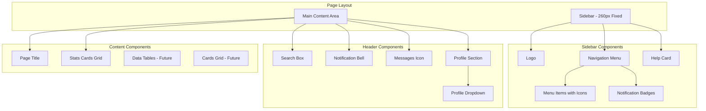

# Core UI Components

> Base UI design system and components for SwapJoys Platform MVP

---

## 📁 Design Files

| File | Description |
|------|-------------|
| [Base HTML-CSS designs.html](./Base%20HTML-CSS%20designs.html) | Complete dashboard layout with all base components |

---

## Overview

| | |
|---|---|
| **Design Style** | Modern, Clean, Professional |
| **Primary Color** | Purple (#6366f1) |
| **Font Family** | Segoe UI, Tahoma, Geneva, Verdana |
| **Layout** | Fixed Sidebar + Scrollable Content |
| **Status** | ✅ Complete |

---

## Component Preview



## Component Architecture

```
┌─────────────────────────────────────────────────────────────────────────────────────────┐
│                                    PAGE LAYOUT                                           │
├─────────────────────────────────────────────────────────────────────────────────────────┤
│                                                                                          │
│     ┌─────────────────────┐                    ┌─────────────────────────────────┐      │
│     │ Sidebar - 260px     │                    │      Main Content Area          │      │
│     │      Fixed          │                    │                                 │      │
│     └──────────┬──────────┘                    └────────────────┬────────────────┘      │
│                │                                                │                       │
└────────────────┼────────────────────────────────────────────────┼───────────────────────┘
                 │                                                │
                 ▼                                                ▼
┌────────────────────────────────┐              ┌────────────────────────────────────────┐
│      SIDEBAR COMPONENTS        │              │           HEADER COMPONENTS            │
├────────────────────────────────┤              ├────────────────────────────────────────┤
│                                │              │                                        │
│  ┌──────────────────────┐     │              │  ┌────────────┐  ┌──────────────────┐  │
│  │        Logo          │     │              │  │ Search Box │  │ Notification Bell│  │
│  └──────────────────────┘     │              │  └────────────┘  └──────────────────┘  │
│             │                 │              │                                        │
│             ▼                 │              │  ┌────────────┐  ┌──────────────────┐  │
│  ┌──────────────────────┐     │              │  │Messages    │  │ Profile Section  │  │
│  │   Navigation Menu    │     │              │  │   Icon     │  └────────┬─────────┘  │
│  └──────────┬───────────┘     │              │  └────────────┘           │            │
│             │                 │              │                           ▼            │
│      ┌──────┴──────┐          │              │                 ┌──────────────────┐   │
│      ▼             ▼          │              │                 │ Profile Dropdown │   │
│ ┌─────────┐ ┌───────────┐     │              │                 └──────────────────┘   │
│ │ Menu    │ │Notification│    │              │                                        │
│ │ Items   │ │  Badges   │     │              └────────────────────────────────────────┘
│ │ w/Icons │ │           │     │
│ └─────────┘ └───────────┘     │              ┌────────────────────────────────────────┐
│             │                 │              │          CONTENT COMPONENTS            │
│             ▼                 │              ├────────────────────────────────────────┤
│  ┌──────────────────────┐     │              │                                        │
│  │      Help Card       │     │              │  ┌──────────────────────────────────┐  │
│  └──────────────────────┘     │              │  │          Page Title              │  │
│                                │              │  └──────────────────────────────────┘  │
└────────────────────────────────┘              │                    │                   │
                                               │                    ▼                   │
                                               │  ┌──────────────────────────────────┐  │
                                               │  │       Stats Cards Grid           │  │
                                               │  └──────────────────────────────────┘  │
                                               │                    │                   │
                                               │         ┌──────────┴──────────┐        │
                                               │         ▼                     ▼        │
                                               │  ┌─────────────┐     ┌─────────────┐   │
                                               │  │ Data Tables │     │ Cards Grid  │   │
                                               │  │  - Future   │     │  - Future   │   │
                                               │  └─────────────┘     └─────────────┘   │
                                               │                                        │
                                               └────────────────────────────────────────┘
```

---

## Page Layout Structure

```
┌──────────────────────────────────────────────────────────────────────────────┐
│                                                                              │
│  ┌────────────┐  ┌─────────────────────────────────────────────────────────┐│
│  │            │  │ HEADER                                                  ││
│  │            │  │ ┌──────────┐ ┌────┐ ┌────┐ ┌─────────────────────────┐  ││
│  │            │  │ │ Search   │ │ 🔔 │ │ ✉️ │ │ Profile ▼               │  ││
│  │            │  │ └──────────┘ └────┘ └────┘ └─────────────────────────┘  ││
│  │  SIDEBAR   │  ├─────────────────────────────────────────────────────────┤│
│  │            │  │ CONTENT                                                 ││
│  │  ┌──────┐  │  │                                                         ││
│  │  │ Logo │  │  │  ┌─────────────────────────────────────────────────┐   ││
│  │  └──────┘  │  │  │ Page Title                                      │   ││
│  │            │  │  │ Subtitle text here                              │   ││
│  │  ┌──────┐  │  │  └─────────────────────────────────────────────────┘   ││
│  │  │ Nav  │  │  │                                                         ││
│  │  │ Menu │  │  │  ┌──────────┐ ┌──────────┐ ┌──────────┐ ┌──────────┐   ││
│  │  │      │  │  │  │  Stats   │ │  Stats   │ │  Stats   │ │  Stats   │   ││
│  │  │ Item │  │  │  │  Card 1  │ │  Card 2  │ │  Card 3  │ │  Card 4  │   ││
│  │  │ Item │  │  │  └──────────┘ └──────────┘ └──────────┘ └──────────┘   ││
│  │  │ Item │  │  │                                                         ││
│  │  │ Item │  │  │                                                         ││
│  │  └──────┘  │  │                                                         ││
│  │            │  │                                                         ││
│  │  ┌──────┐  │  │                                                         ││
│  │  │ Help │  │  │                                                         ││
│  │  │ Card │  │  │                                                         ││
│  │  └──────┘  │  │                                                         ││
│  │            │  │                                                         ││
│  └────────────┘  └─────────────────────────────────────────────────────────┘│
│                                                                              │
└──────────────────────────────────────────────────────────────────────────────┘
```

---

## Sidebar Components

```
┌────────────────────────────────┐
│        SIDEBAR (260px)         │
├────────────────────────────────┤
│                                │
│  ┌──────────────────────────┐  │
│  │  [S]  SwapJoys           │  │  ◄── Logo
│  └──────────────────────────┘  │
│                                │
│  ─────────────────────────────  │
│                                │
│  MAIN MENU                     │  ◄── Navigation Menu
│                                │
│  ┌──────────────────────────┐  │
│  │ ▣  Dashboard        ●    │  │  ◄── Menu Items with Icons
│  └──────────────────────────┘  │      (● = Active)
│  ┌──────────────────────────┐  │
│  │ 🏪 Marketplace      [12] │  │  ◄── Notification Badge
│  └──────────────────────────┘  │
│  ┌──────────────────────────┐  │
│  │ 🎫 My Bookings           │  │
│  └──────────────────────────┘  │
│  ┌──────────────────────────┐  │
│  │ 💰 Points & Balance      │  │
│  └──────────────────────────┘  │
│                                │
│  ─────────────────────────────  │
│                                │
│  MANAGEMENT                    │
│                                │
│  ┌──────────────────────────┐  │
│  │ 👥 Employees             │  │
│  └──────────────────────────┘  │
│  ┌──────────────────────────┐  │
│  │ ✨ Experiences           │  │
│  └──────────────────────────┘  │
│  ┌──────────────────────────┐  │
│  │ 📊 Tax Reports           │  │
│  └──────────────────────────┘  │
│  ┌──────────────────────────┐  │
│  │ ⚙️  Settings             │  │
│  └──────────────────────────┘  │
│                                │
│  ─────────────────────────────  │
│                                │
│  ┌──────────────────────────┐  │
│  │      🎧 Need Help?       │  │  ◄── Help Card
│  │   Contact our support    │  │
│  │      [ Get Support ]     │  │
│  └──────────────────────────┘  │
│                                │
└────────────────────────────────┘
```

---

## Header Components

```
┌──────────────────────────────────────────────────────────────────────────────┐
│                              HEADER                                          │
├──────────────────────────────────────────────────────────────────────────────┤
│                                                                              │
│  ┌────────────────────────────┐                    ┌────┐ ┌────┐ ┌────────┐ │
│  │ 🔍 Search experiences...   │                    │ 🔔 │ │ ✉️ │ │Profile │ │
│  └────────────────────────────┘                    │ •  │ │    │ │   ▼    │ │
│         Search Box                                 └────┘ └────┘ └───┬────┘ │
│                                                   Notif.  Msgs.      │      │
│                                                   Bell    Icon       │      │
│                                                                      ▼      │
│                                               ┌─────────────────────────┐   │
│                                               │    Profile Dropdown     │   │
│                                               ├─────────────────────────┤   │
│                                               │ 👤 My Profile           │   │
│                                               │ 🏢 Company Settings     │   │
│                                               │ 💳 Subscription         │   │
│                                               │ 🔒 Privacy & Security   │   │
│                                               ├─────────────────────────┤   │
│                                               │ ❓ Help & Support       │   │
│                                               │ 💬 Send Feedback        │   │
│                                               ├─────────────────────────┤   │
│                                               │ 🚪 Log Out              │   │
│                                               └─────────────────────────┘   │
│                                                                              │
└──────────────────────────────────────────────────────────────────────────────┘
```

---

## Content Components

```
┌──────────────────────────────────────────────────────────────────────────────┐
│                            CONTENT AREA                                      │
├──────────────────────────────────────────────────────────────────────────────┤
│                                                                              │
│  ┌────────────────────────────────────────────────────────────────────────┐  │
│  │  Page Title                                                            │  │
│  │  Subtitle / description text                                           │  │
│  └────────────────────────────────────────────────────────────────────────┘  │
│                                                                              │
│  ┌────────────────────────────────────────────────────────────────────────┐  │
│  │                         STATS CARDS GRID                               │  │
│  │                                                                        │  │
│  │  ┌──────────────┐  ┌──────────────┐  ┌──────────────┐  ┌────────────┐  │  │
│  │  │ 💰           │  │ ✅           │  │ ⏰           │  │ 👥         │  │  │
│  │  │              │  │              │  │              │  │            │  │  │
│  │  │   1,250      │  │     24       │  │      5       │  │    18      │  │  │
│  │  │              │  │              │  │              │  │            │  │  │
│  │  │  Available   │  │  Completed   │  │   Pending    │  │  Active    │  │  │
│  │  │   Points     │  │  Bookings    │  │  Requests    │  │ Employees  │  │  │
│  │  └──────────────┘  └──────────────┘  └──────────────┘  └────────────┘  │  │
│  │                                                                        │  │
│  └────────────────────────────────────────────────────────────────────────┘  │
│                                                                              │
│  ┌──────────────────────────────────┐  ┌──────────────────────────────────┐  │
│  │       DATA TABLES (Future)       │  │       CARDS GRID (Future)        │  │
│  │                                  │  │                                  │  │
│  │  • Employee list                 │  │  • Experience cards              │  │
│  │  • Transaction history           │  │  • Booking cards                 │  │
│  │  • Usage logs                    │  │  • Ticket cards                  │  │
│  │                                  │  │                                  │  │
│  └──────────────────────────────────┘  └──────────────────────────────────┘  │
│                                                                              │
└──────────────────────────────────────────────────────────────────────────────┘
```

---

## Component Summary

| Component | Location | Description |
|-----------|----------|-------------|
| Logo | Sidebar | SwapJoys branding |
| Navigation Menu | Sidebar | Main & Management sections |
| Menu Items with Icons | Sidebar | Dashboard, Marketplace, etc. |
| Notification Badges | Sidebar | Count indicators |
| Help Card | Sidebar | Support contact |
| Search Box | Header | Search experiences |
| Notification Bell | Header | Alerts indicator |
| Messages Icon | Header | Messages indicator |
| Profile Section | Header | User info display |
| Profile Dropdown | Header | Settings & logout menu |
| Page Title | Content | Current page heading |
| Stats Cards Grid | Content | 4 metric cards |
| Data Tables | Content | Future - lists & tables |
| Cards Grid | Content | Future - card layouts |

---

## Design System

### Colors

| Name | Hex Code | Usage |
|------|----------|-------|
| Primary | `#6366f1` | Buttons, active states, links |
| Primary Hover | `#5558e3` | Button hover states |
| Primary Light | `rgba(99,102,241,0.12)` | Icon backgrounds |
| Purple Accent | `#8b5cf6` | Gradients, highlights |
| Success Green | `#22c55e` | Online status, success |
| Warning Orange | `#f97316` | Pending status, warnings |
| Error Red | `#ef4444` | Errors, logout, badges |
| Dark Blue | `#1a1f36` | Sidebar background |
| Dark Blue Light | `#252b48` | Sidebar gradient |
| Text Primary | `#1f2937` | Headings, main text |
| Text Secondary | `#6b7280` | Subtitles, labels |
| Text Muted | `#9ca3af` | Placeholders, hints |
| Border | `#e5e7eb` | Dividers, borders |
| Background | `#f4f6f9` | Page background |
| Card Background | `#ffffff` | Cards, modals |

### Typography

| Element | Size | Weight | Color |
|---------|------|--------|-------|
| Logo Text | 22px | 700 | #ffffff |
| Page Title | 28px | 700 | #1f2937 |
| Page Subtitle | 15px | 400 | #6b7280 |
| Nav Label | 11px | 600 | rgba(255,255,255,0.4) |
| Nav Link | 14px | 500 | rgba(255,255,255,0.7) |
| Card Value | 32px | 700 | #1f2937 |
| Card Label | 14px | 400 | #6b7280 |
| Button | 13px | 600 | #ffffff |
| Input | 14px | 400 | #1f2937 |
| Dropdown Item | 14px | 400 | #374151 |

### Spacing

| Name | Value | Usage |
|------|-------|-------|
| xs | 4px | Icon gaps, badge padding |
| sm | 8px | Small gaps, dropdown dividers |
| md | 16px | Card padding, section gaps |
| lg | 24px | Page padding, card margins |
| xl | 32px | Large sections |

### Border Radius

| Name | Value | Usage |
|------|-------|-------|
| sm | 8px | Buttons, inputs |
| md | 10px | Nav links, badges |
| lg | 12px | Cards, dropdowns, avatars |
| xl | 16px | Large cards, profile section |

### Shadows

| Name | Value | Usage |
|------|-------|-------|
| Sidebar | `4px 0 20px rgba(0,0,0,0.1)` | Sidebar |
| Header | `0 2px 12px rgba(0,0,0,0.04)` | Header |
| Card | `0 2px 12px rgba(0,0,0,0.04)` | Cards |
| Card Hover | `0 8px 24px rgba(0,0,0,0.08)` | Card hover |
| Dropdown | `0 10px 40px rgba(0,0,0,0.12)` | Dropdowns |
| Button Active | `0 4px 15px rgba(99,102,241,0.4)` | Active nav |

---

## Components

### 1. Sidebar

| Property | Value |
|----------|-------|
| Width | 260px |
| Position | Fixed, left |
| Background | Gradient (#1a1f36 → #252b48) |
| Sections | Logo, Nav Menu, Help Card |

**Sub-components:**
- Logo (icon + text)
- Nav Section Label
- Nav Menu Items (icon + text + optional badge)
- Active State (gradient background + shadow)
- Help Card (icon + title + text + button)

---

### 2. Header

| Property | Value |
|----------|-------|
| Height | Auto (padding 16px) |
| Position | Sticky, top |
| Background | #ffffff |
| Shadow | 0 2px 12px rgba(0,0,0,0.04) |

**Sub-components:**
- Search Box (icon + input)
- Header Buttons (bell, envelope)
- Notification Dot
- Divider
- Profile Section

---

### 3. Profile Section

| Property | Value |
|----------|-------|
| Layout | Avatar + Info + Arrow |
| Background | #f9fafb |
| Border Radius | 16px |
| Hover | Border color change |

**Sub-components:**
- Profile Avatar (initials + online dot)
- Profile Info (name + role)
- Chevron Arrow (rotates on open)

---

### 4. Profile Dropdown

| Property | Value |
|----------|-------|
| Position | Absolute, below profile |
| Min Width | 240px |
| Background | #ffffff |
| Border Radius | 12px |
| Shadow | 0 10px 40px rgba(0,0,0,0.12) |
| Animation | Fade + slide (0.2s) |

**Menu Items:**
- My Profile
- Company Settings
- Subscription
- Privacy & Security
- (divider)
- Help & Support
- Send Feedback
- (divider)
- Log Out (red)

---

### 5. Stats Card

| Property | Value |
|----------|-------|
| Layout | Icon + Value + Label |
| Background | #ffffff |
| Border Radius | 16px |
| Padding | 24px |
| Hover | translateY(-2px) + shadow |

**Icon Variants:**

| Type | Background | Icon Color |
|------|------------|------------|
| Blue | rgba(99,102,241,0.12) | #6366f1 |
| Green | rgba(34,197,94,0.12) | #22c55e |
| Orange | rgba(249,115,22,0.12) | #f97316 |
| Purple | rgba(168,85,247,0.12) | #a855f7 |

**Stats Cards in Design:**

| Icon | Value | Label |
|------|-------|-------|
| Coins (blue) | 1,250 | Available Points |
| Check Circle (green) | 24 | Completed Bookings |
| Clock (orange) | 5 | Pending Requests |
| Users (purple) | 18 | Active Employees |

---

### 6. Navigation Menu

**Main Menu Items:**

| Icon | Label | Badge |
|------|-------|-------|
| th-large | Dashboard | — |
| store | Marketplace | 12 |
| ticket-alt | My Bookings | — |
| coins | Points & Balance | — |

**Management Menu Items:**

| Icon | Label |
|------|-------|
| users | Employees |
| calendar-plus | Experiences |
| file-invoice | Tax Reports |
| cog | Settings |

---

### 7. Search Box

| Property | Value |
|----------|-------|
| Width | 380px |
| Padding | 12px 16px 12px 46px |
| Border | 2px solid #e5e7eb |
| Border Radius | 12px |
| Focus | Border #6366f1 + shadow |

---

### 8. Header Button

| Property | Value |
|----------|-------|
| Size | 44px × 44px |
| Background | #f3f4f6 |
| Border Radius | 12px |
| Hover | #e5e7eb |

**With Notification Dot:**
- Size: 8px
- Color: #ef4444
- Position: top-right

---

### 9. Help Card

| Property | Value |
|----------|-------|
| Background | rgba(99,102,241,0.15) |
| Border Radius | 12px |
| Padding | 18px |
| Content | Icon + Title + Text + Button |

---

## Layout Grid

### Page Structure

```
┌─────────────────────────────────────────────────────────┐
│                                                         │
│  ┌──────────┐  ┌─────────────────────────────────────┐ │
│  │          │  │ HEADER (Search + Icons + Profile)   │ │
│  │          │  ├─────────────────────────────────────┤ │
│  │          │  │                                     │ │
│  │ SIDEBAR  │  │  CONTENT                            │ │
│  │ (260px)  │  │                                     │ │
│  │          │  │  ┌────┐ ┌────┐ ┌────┐ ┌────┐       │ │
│  │  Fixed   │  │  │Card│ │Card│ │Card│ │Card│       │ │
│  │          │  │  └────┘ └────┘ └────┘ └────┘       │ │
│  │          │  │                                     │ │
│  │          │  │                                     │ │
│  └──────────┘  └─────────────────────────────────────┘ │
│                                                         │
└─────────────────────────────────────────────────────────┘
```

### Stats Grid

```css
display: grid;
grid-template-columns: repeat(4, 1fr);
gap: 24px;
```

---

## Interactive States

| Component | State | Change |
|-----------|-------|--------|
| Nav Link | Hover | Background rgba(255,255,255,0.08) |
| Nav Link | Active | Gradient + shadow |
| Stat Card | Hover | translateY(-2px) + shadow |
| Header Button | Hover | Background #e5e7eb |
| Profile | Hover | Border #e5e7eb |
| Profile | Active | Border #6366f1 |
| Dropdown Item | Hover | Background #f3f4f6 |
| Search Input | Focus | Border #6366f1 + shadow |
| Help Button | Hover | translateY(-1px) |

---

## Icons Used (Font Awesome 6)

| Icon | Class | Usage |
|------|-------|-------|
| Dashboard | `fa-th-large` | Nav menu |
| Store | `fa-store` | Marketplace |
| Ticket | `fa-ticket-alt` | Bookings |
| Coins | `fa-coins` | Points |
| Users | `fa-users` | Employees |
| Calendar | `fa-calendar-plus` | Experiences |
| Invoice | `fa-file-invoice` | Tax Reports |
| Settings | `fa-cog` | Settings |
| Search | `fa-search` | Search box |
| Bell | `fa-bell` | Notifications |
| Envelope | `fa-envelope` | Messages |
| Chevron | `fa-chevron-down` | Dropdown arrow |
| Headset | `fa-headset` | Help card |
| Check Circle | `fa-check-circle` | Completed |
| Clock | `fa-clock` | Pending |

---

## Status

| Component | Status |
|-----------|--------|
| Sidebar Layout | ✅ Complete |
| Logo Design | ✅ Complete |
| Navigation Menu | ✅ Complete |
| Header Layout | ✅ Complete |
| Search Box | ✅ Complete |
| Profile Section | ✅ Complete |
| Profile Dropdown | ✅ Complete |
| Stats Cards | ✅ Complete |
| Color System | ✅ Complete |
| Typography System | ✅ Complete |
| Icon Library | ✅ Complete |
| Interactive States | ✅ Complete |

---

**Prepared by:** Rebing Tech  
**Project:** SwapJoys Platform MVP  
**Milestone:** 1 of 8
