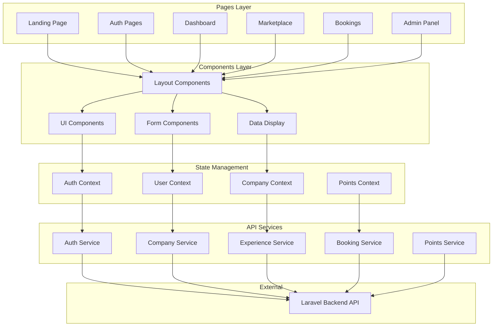

# Frontend Application Foundation

> React frontend architecture for SwapJoys Platform MVP

---

## 📊 Architecture Diagram



---

## Overview

| | |
|---|---|
| **Framework** | React 18.x |
| **Language** | JavaScript / JSX |
| **Styling** | Tailwind CSS / Custom CSS |
| **State Management** | React Context API |
| **Routing** | React Router v6 |
| **HTTP Client** | Axios |
| **Status** | ✅ Foundation Complete |

---

## Project Structure

```
swapjoys-frontend/
├── public/
│   ├── index.html
│   ├── favicon.ico
│   └── assets/
│       └── images/
├── src/
│   ├── components/
│   │   ├── layout/
│   │   │   ├── Sidebar.jsx
│   │   │   ├── Header.jsx
│   │   │   ├── Footer.jsx
│   │   │   ├── MainLayout.jsx
│   │   │   └── AdminLayout.jsx
│   │   ├── ui/
│   │   │   ├── Button.jsx
│   │   │   ├── Input.jsx
│   │   │   ├── Select.jsx
│   │   │   ├── Modal.jsx
│   │   │   ├── Card.jsx
│   │   │   ├── Badge.jsx
│   │   │   ├── Alert.jsx
│   │   │   └── Loader.jsx
│   │   ├── forms/
│   │   │   ├── LoginForm.jsx
│   │   │   ├── RegisterForm.jsx
│   │   │   ├── ExperienceForm.jsx
│   │   │   ├── BookingForm.jsx
│   │   │   └── EmployeeForm.jsx
│   │   └── shared/
│   │       ├── StatsCard.jsx
│   │       ├── ExperienceCard.jsx
│   │       ├── BookingCard.jsx
│   │       ├── TicketCard.jsx
│   │       ├── QRCodeDisplay.jsx
│   │       └── ProfileDropdown.jsx
│   ├── pages/
│   │   ├── public/
│   │   │   ├── Landing.jsx
│   │   │   ├── Login.jsx
│   │   │   ├── Register.jsx
│   │   │   ├── ForgotPassword.jsx
│   │   │   └── VerifyEmail.jsx
│   │   ├── dashboard/
│   │   │   ├── Dashboard.jsx
│   │   │   ├── CompanyProfile.jsx
│   │   │   └── Settings.jsx
│   │   ├── employees/
│   │   │   ├── EmployeeList.jsx
│   │   │   ├── AddEmployee.jsx
│   │   │   └── EmployeeDetail.jsx
│   │   ├── experiences/
│   │   │   ├── Marketplace.jsx
│   │   │   ├── ExperienceDetail.jsx
│   │   │   ├── MyExperiences.jsx
│   │   │   └── CreateExperience.jsx
│   │   ├── bookings/
│   │   │   ├── MyBookings.jsx
│   │   │   ├── IncomingRequests.jsx
│   │   │   └── BookingDetail.jsx
│   │   ├── tickets/
│   │   │   ├── MyTickets.jsx
│   │   │   ├── TicketDetail.jsx
│   │   │   └── Scanner.jsx
│   │   ├── points/
│   │   │   ├── Balance.jsx
│   │   │   └── Transactions.jsx
│   │   ├── tax/
│   │   │   ├── UsageLogs.jsx
│   │   │   ├── YearlySummary.jsx
│   │   │   └── ExportReport.jsx
│   │   ├── subscription/
│   │   │   └── Subscription.jsx
│   │   └── admin/
│   │       ├── AdminDashboard.jsx
│   │       ├── AdminCompanies.jsx
│   │       ├── AdminExperiences.jsx
│   │       ├── AdminLogs.jsx
│   │       └── AdminPointAdjust.jsx
│   ├── context/
│   │   ├── AuthContext.jsx
│   │   ├── UserContext.jsx
│   │   ├── CompanyContext.jsx
│   │   └── PointsContext.jsx
│   ├── services/
│   │   ├── api.js
│   │   ├── authService.js
│   │   ├── companyService.js
│   │   ├── employeeService.js
│   │   ├── experienceService.js
│   │   ├── bookingService.js
│   │   ├── ticketService.js
│   │   ├── pointsService.js
│   │   ├── taxService.js
│   │   └── adminService.js
│   ├── hooks/
│   │   ├── useAuth.js
│   │   ├── useCompany.js
│   │   ├── useExperiences.js
│   │   └── usePoints.js
│   ├── utils/
│   │   ├── constants.js
│   │   ├── helpers.js
│   │   ├── validators.js
│   │   └── formatters.js
│   ├── styles/
│   │   ├── globals.css
│   │   ├── variables.css
│   │   └── components.css
│   ├── routes/
│   │   ├── AppRoutes.jsx
│   │   ├── PrivateRoute.jsx
│   │   ├── PublicRoute.jsx
│   │   └── AdminRoute.jsx
│   ├── App.jsx
│   └── index.js
├── .env.example
├── package.json
└── tailwind.config.js
```

---

## Route Structure

### Public Routes
| Path | Component | Description |
|------|-----------|-------------|
| `/` | Landing | Landing page |
| `/login` | Login | User login |
| `/register` | Register | Company registration |
| `/forgot-password` | ForgotPassword | Password reset |
| `/verify-email/:token` | VerifyEmail | Email verification |

### Protected Routes (Auth Required)
| Path | Component | Role Access |
|------|-----------|-------------|
| `/dashboard` | Dashboard | All |
| `/profile` | CompanyProfile | All |
| `/settings` | Settings | Owner |

### Employee Routes
| Path | Component | Role Access |
|------|-----------|-------------|
| `/employees` | EmployeeList | Owner, Manager |
| `/employees/add` | AddEmployee | Owner, Manager |
| `/employees/:id` | EmployeeDetail | Owner, Manager |

### Experience Routes
| Path | Component | Role Access |
|------|-----------|-------------|
| `/marketplace` | Marketplace | All |
| `/marketplace/:id` | ExperienceDetail | All |
| `/my-experiences` | MyExperiences | Owner, Manager |
| `/experiences/create` | CreateExperience | Owner, Manager |

### Booking Routes
| Path | Component | Role Access |
|------|-----------|-------------|
| `/bookings` | MyBookings | All |
| `/bookings/requests` | IncomingRequests | Owner, Manager |
| `/bookings/:id` | BookingDetail | All |

### Ticket Routes
| Path | Component | Role Access |
|------|-----------|-------------|
| `/tickets` | MyTickets | All |
| `/tickets/:id` | TicketDetail | All |
| `/scanner` | Scanner | Owner, Manager |

### Points & Tax Routes
| Path | Component | Role Access |
|------|-----------|-------------|
| `/balance` | Balance | All |
| `/transactions` | Transactions | Owner, Manager |
| `/tax/usage` | UsageLogs | Owner |
| `/tax/summary` | YearlySummary | Owner |
| `/tax/export` | ExportReport | Owner |

### Admin Routes
| Path | Component | Role Access |
|------|-----------|-------------|
| `/admin` | AdminDashboard | SwapJoys Admin |
| `/admin/companies` | AdminCompanies | SwapJoys Admin |
| `/admin/experiences` | AdminExperiences | SwapJoys Admin |
| `/admin/logs` | AdminLogs | SwapJoys Admin |
| `/admin/points` | AdminPointAdjust | SwapJoys Admin |

---

## State Management (Context)

### AuthContext
```javascript
{
  user: null | Object,
  token: null | String,
  isAuthenticated: Boolean,
  login: Function,
  logout: Function,
  register: Function
}
```

### CompanyContext
```javascript
{
  company: null | Object,
  employees: Array,
  updateCompany: Function,
  refreshEmployees: Function
}
```

### PointsContext
```javascript
{
  balance: Number,
  transactions: Array,
  refreshBalance: Function,
  refreshTransactions: Function
}
```

---

## API Service Structure

### api.js (Base Configuration)
```javascript
// Axios instance with base URL and interceptors
const API_BASE_URL = process.env.REACT_APP_API_URL

// Request interceptor: Add JWT token
// Response interceptor: Handle 401 errors
```

### Service Pattern
| Service | Methods |
|---------|---------|
| `authService` | login, register, logout, forgotPassword, resetPassword, verifyEmail |
| `companyService` | getProfile, updateProfile |
| `employeeService` | list, create, update, delete, invite |
| `experienceService` | list, get, create, update, delete, filter |
| `bookingService` | create, list, approve, reject |
| `ticketService` | list, get, verify |
| `pointsService` | getBalance, getTransactions |
| `taxService` | getUsageLogs, getYearlySummary, exportCSV |
| `adminService` | getCompanies, getLogs, adjustPoints |

---

## Design System

### Colors
| Name | Value | Usage |
|------|-------|-------|
| Primary | `#6366f1` | Buttons, links, highlights |
| Primary Dark | `#5558e3` | Hover states |
| Success | `#22c55e` | Success messages, online status |
| Warning | `#f97316` | Warnings, pending status |
| Error | `#ef4444` | Errors, delete actions |
| Purple | `#a855f7` | Accents |
| Dark | `#1a1f36` | Sidebar, dark backgrounds |
| Gray | `#6b7280` | Secondary text |

### Typography
| Element | Size | Weight |
|---------|------|--------|
| H1 (Page Title) | 28px | 700 |
| H2 (Section) | 22px | 600 |
| H3 (Card Title) | 16px | 600 |
| Body | 14px | 400 |
| Small | 12px | 400 |

### Spacing
| Name | Value |
|------|-------|
| xs | 4px |
| sm | 8px |
| md | 16px |
| lg | 24px |
| xl | 32px |

### Border Radius
| Name | Value |
|------|-------|
| sm | 8px |
| md | 12px |
| lg | 16px |

---

## Environment Configuration

### .env.example
```env
REACT_APP_NAME=SwapJoys
REACT_APP_API_URL=http://localhost:8000/api
REACT_APP_ENV=development
```

---

## Component Examples

### Layout Component (Sidebar)
- Logo with branding
- Navigation menu with icons
- Active state highlighting
- Notification badges
- Help card at bottom

### UI Components
- Button (primary, secondary, danger variants)
- Input (text, email, password, with validation)
- Select (dropdown with search)
- Modal (confirm dialogs, forms)
- Card (stats, experiences, bookings)
- Badge (status indicators)
- Alert (success, error, warning)
- Loader (spinner, skeleton)

### Shared Components
- StatsCard (icon, value, label)
- ExperienceCard (photo, title, points, city)
- BookingCard (experience, status, date)
- TicketCard (QR code, backup code, status)
- ProfileDropdown (user info, menu items)

---

## Status

| Component | Status |
|-----------|--------|
| Project Structure | ✅ Complete |
| Route Configuration | ✅ Complete |
| Context Setup | ✅ Complete |
| API Services | ✅ Complete |
| Layout Components | ✅ Complete |
| Base UI Components | ✅ Complete |
| Design System | ✅ Complete |
| Environment Config | ✅ Complete |

---

**Prepared by:** Rebing Tech  
**Project:** SwapJoys Platform MVP  
**Milestone:** 1 of 8
