# SwapJoys Platform - Flow Diagram
## Milestone 3: Employee Onboarding & Roles (Features 2, 3)

| | |
|---|---|
| **Project** | SwapJoys Platform MVP |
| **Milestone** | 3 of 8 |
| **Features** | Employee Onboarding (F2), Role Assignment (F3) |
| **Prepared by** | Rebing Tech |
| **Date** | February 2026 |
| **Status** | Ready for Client Approval |

---

## Flow Diagram

```mermaid
flowchart TB
    subgraph ENTRY["🚀 ENTRY POINT"]
        A[Owner/Manager Dashboard]
    end
    
    subgraph EMPLOYEE_LIST["📋 EMPLOYEE LIST - Screen 1"]
        B[Click Employees in Sidebar]
        C[View Employee List]
        D[Search/Filter Employees]
        E{Select Action}
    end
    
    subgraph ADD_EMPLOYEE["➕ ADD EMPLOYEE - Feature 2"]
        F[Click Add Employee Button]
        G[Open Add Employee Modal]
        H[Enter Name]
        I[Enter Email]
        J[Enter Phone - Optional]
        K[Select Role]
        L[View Role Permissions]
        M[Click Send Invitation]
        N{Validate Fields}
        O[Create Employee Record<br/>Status: Pending]
        P[Generate Invitation Token<br/>7 days expiry]
        Q[Send Invitation Email]
        R[Show Success Message]
        S[Return to Employee List]
    end
    
    subgraph INVITATION["📧 EMPLOYEE INVITATION - Feature 2"]
        T[Employee Receives Email]
        U[Open Email from SwapJoys]
        V[Click Accept Invitation]
        W{Validate Token}
        X[Token Valid]
        Y[Token Invalid/Expired]
        Z[Show Error Message]
        AA[Contact Admin]
    end
    
    subgraph ACTIVATION["🔐 ACCOUNT ACTIVATION - Feature 2"]
        AB[Display Activation Page]
        AC[Show Company Name]
        AD[Show Assigned Role]
        AE[Enter Password]
        AF[Enter Confirm Password]
        AG[Real-time Password Validation]
        AH[Click Activate Account]
        AI{Passwords Valid?}
        AJ[Update User Password]
        AK[Set Status: Active]
        AL[Delete Invitation Token]
        AM[Show Success Screen]
        AN[Redirect to Login]
    end
    
    subgraph ROLE_MANAGEMENT["👔 ROLE MANAGEMENT - Feature 3"]
        AO[View Employee Detail]
        AP[Click Change Role]
        AQ{Is Owner?}
        AR[Show Role Dropdown]
        AS[Select New Role]
        AT[Show Role Permissions Preview]
        AU[Click Save]
        AV{Can Change?}
        AW[Update Role in Database]
        AX[Show Success Message]
        AY[Show Error: Last Owner]
        AZ[Show Error: No Permission]
    end
    
    subgraph EMPLOYEE_DETAIL["👤 EMPLOYEE DETAIL - Screen 3"]
        BA[Click Employee Row]
        BB[Load Employee Data]
        BC[Display Employee Info]
        BD{Select Action}
        BE[Edit Employee]
        BF[Deactivate Employee]
        BG[Resend Invitation]
    end

    %% Main Flow
    A --> B
    B --> C
    C --> D
    D --> E
    
    %% Add Employee Flow
    E -->|Add New| F
    F --> G
    G --> H
    H --> I
    I --> J
    J --> K
    K --> L
    L --> M
    M --> N
    N -->|Invalid| G
    N -->|Valid| O
    O --> P
    P --> Q
    Q --> R
    R --> S
    S --> C
    
    %% Invitation Flow
    Q --> T
    T --> U
    U --> V
    V --> W
    W -->|Valid| X
    W -->|Invalid| Y
    X --> AB
    Y --> Z
    Z --> AA
    
    %% Activation Flow
    AB --> AC
    AC --> AD
    AD --> AE
    AE --> AF
    AF --> AG
    AG --> AH
    AH --> AI
    AI -->|No| AE
    AI -->|Yes| AJ
    AJ --> AK
    AK --> AL
    AL --> AM
    AM --> AN
    
    %% Employee Detail Flow
    E -->|View| BA
    BA --> BB
    BB --> BC
    BC --> BD
    BD -->|Edit| BE
    BD -->|Deactivate| BF
    BD -->|Resend| BG
    BD -->|Change Role| AO
    
    %% Role Management Flow
    AO --> AP
    AP --> AQ
    AQ -->|No| AZ
    AQ -->|Yes| AR
    AR --> AS
    AS --> AT
    AT --> AU
    AU --> AV
    AV -->|No - Last Owner| AY
    AV -->|Yes| AW
    AW --> AX
    AX --> BC

    %% Styling
    style ENTRY fill:#e0e7ff,stroke:#6366f1,stroke-width:2px
    style EMPLOYEE_LIST fill:#fef3c7,stroke:#f59e0b,stroke-width:2px
    style ADD_EMPLOYEE fill:#d1fae5,stroke:#10b981,stroke-width:2px
    style INVITATION fill:#fce7f3,stroke:#ec4899,stroke-width:2px
    style ACTIVATION fill:#dbeafe,stroke:#3b82f6,stroke-width:2px
    style ROLE_MANAGEMENT fill:#f3e8ff,stroke:#a855f7,stroke-width:2px
    style EMPLOYEE_DETAIL fill:#fed7aa,stroke:#f97316,stroke-width:2px
```

---

## Flow Summary

| Flow | Description | Actor |
|------|-------------|-------|
| Employee List | View, search, filter all employees | Owner/Manager |
| Add Employee | Add new employee and send invitation | Owner/Manager |
| Invitation | Employee receives and clicks email link | Invited Employee |
| Activation | Set password and activate account | Invited Employee |
| Role Management | Change employee roles | Owner only |
| Employee Detail | View, edit, deactivate employees | Owner/Manager |

---

## Key Decision Points

| Decision | Yes Path | No Path |
|----------|----------|---------|
| Validate Fields | Create record, send email | Show errors, stay on form |
| Token Valid? | Show activation page | Show error, contact admin |
| Passwords Valid? | Activate account | Show validation errors |
| Is Owner? | Show role dropdown | Show no permission error |
| Can Change Role? | Update role | Show last owner error |

---

**Prepared by:** Rebing Tech  
**Project:** SwapJoys Platform MVP  
**Milestone:** 3 of 8
