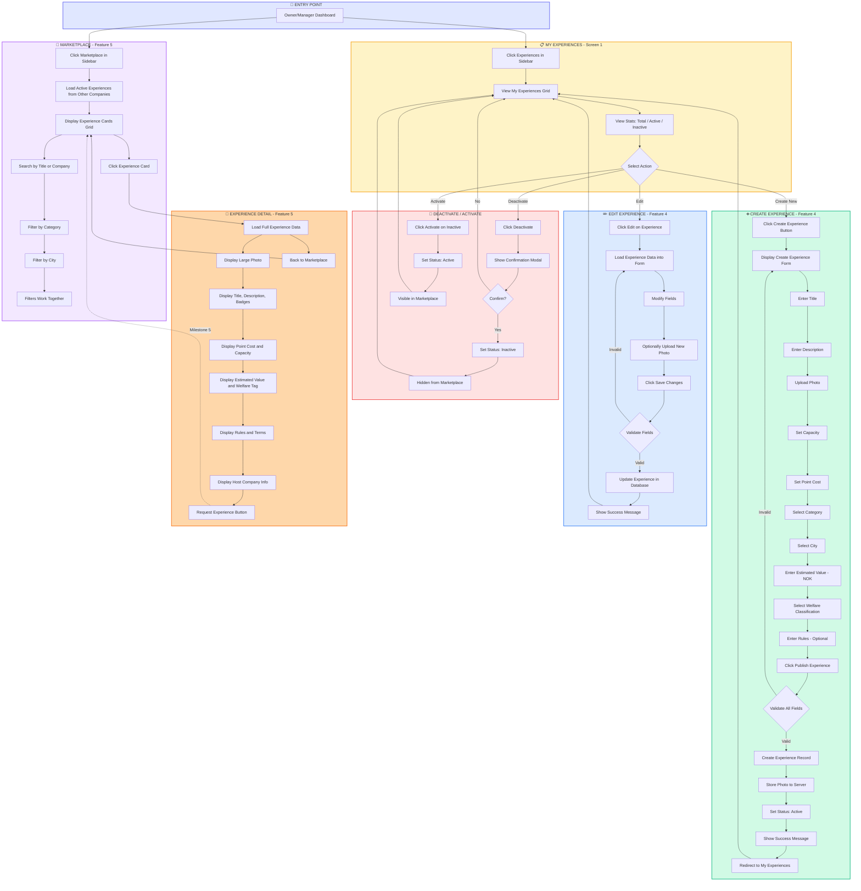

# SwapJoys Platform - Flow Diagram
## Milestone 4: Experience Creation & Marketplace (Features 4, 5)

| | |
|---|---|
| **Project** | SwapJoys Platform MVP |
| **Milestone** | 4 of 8 |
| **Features** | Create Experience (F4), Browse Experiences (F5) |
| **Prepared by** | Rebing Tech |
| **Date** | February 2026 |
| **Status** | Ready for Client Approval |

---

## Flow Diagram

---

## Flow Summary

| Flow | Description | Actor |
|------|-------------|-------|
| My Experiences | View, manage company's own experiences | Owner/Manager |
| Create Experience | Fill form, upload photo, publish to marketplace | Owner/Manager |
| Edit Experience | Modify existing experience details | Owner/Manager |
| Deactivate/Activate | Toggle experience visibility in marketplace | Owner/Manager |
| Marketplace | Browse, search, filter experiences from other companies | All Roles |
| Experience Detail | View full details of an experience | All Roles |

---

## Key Decision Points

| Decision | Yes Path | No Path |
|----------|----------|---------|
| Validate All Fields (Create) | Create record, store photo, publish | Show errors, stay on form |
| Validate Fields (Edit) | Update record | Show errors, stay on form |
| Confirm Deactivation? | Set inactive, hide from marketplace | Cancel, return to list |

---

**Prepared by:** Rebing Tech  
**Project:** SwapJoys Platform MVP  
**Milestone:** 4 of 8
