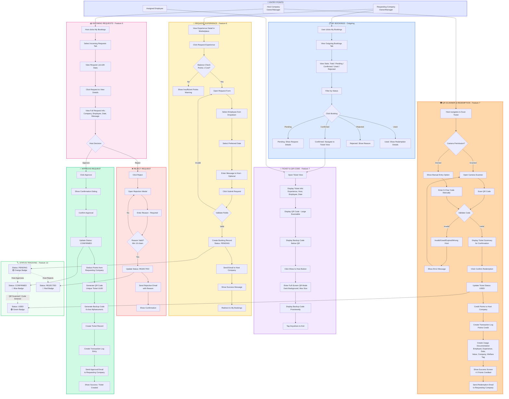

# SwapJoys Platform - Flow Diagram
## Milestone 5: Booking & QR Verification (Features 6, 7, 13)

| | |
|---|---|
| **Project** | SwapJoys Platform MVP |
| **Milestone** | 5 of 8 |
| **Features** | Request/Book Experience (F6), QR/Unique Code Verification (F7), Experience Status Tracking (F13) |
| **Prepared by** | Rebing Tech |
| **Date** | March 2026 |
| **Status** | Ready for Client Approval |

---

## Flow Diagram



---

## Flow Summary

| Flow | Description | Actor |
|------|-------------|-------|
| Request Experience | Select employee, date, submit request | Requesting Company Owner/Manager |
| Incoming Requests | View, approve, or reject booking requests | Host Company Owner/Manager |
| Approve Request | Deduct points, generate QR + backup code, create ticket | Host Company Owner/Manager |
| Reject Request | Decline with reason, notify requesting company | Host Company Owner/Manager |
| My Bookings | View all outgoing bookings with status | Requesting Company (All Roles) |
| Ticket & QR Display | View ticket, show QR in full-screen to host | Assigned Employee |
| QR Scanner | Scan QR or enter manual code, confirm redemption | Host Company Owner/Manager |
| Status Tracking | Visual status badges across all views | All Roles |

---

## Key Decision Points

| Decision | Yes Path | No Path |
|----------|----------|---------|
| Balance ≥ Cost? | Open request form | Show insufficient points warning |
| Validate Request Fields? | Create booking, send notification | Show errors, stay on form |
| Host Approves? | Deduct points, create ticket + QR | — |
| Host Rejects? | Update status, notify with reason | — |
| Rejection Reason Valid? | Process rejection | Stay on modal |
| Camera Permission Granted? | Open QR scanner | Show manual code entry |
| Code Valid? | Show ticket summary for confirmation | Show error, retry |

---

## Points Settlement Flow

```
REQUEST SUBMITTED
    └── Points checked but NOT deducted
    
HOST APPROVES
    └── Points DEDUCTED from requesting company
    └── Ticket + QR code created
    
TICKET REDEEMED (QR Scanned)
    └── Points CREDITED to host company
    └── Transaction logged
    └── Usage documented for tax
```

---

**Prepared by:** Rebing Tech  
**Project:** SwapJoys Platform MVP  
**Milestone:** 5 of 8
