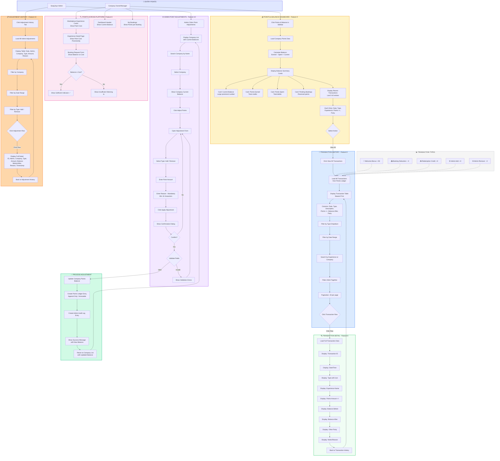

# SwapJoys Platform - Flow Diagram
## Milestone 6: Points System & Balance (Features 8, 9, 10)

| | |
|---|---|
| **Project** | SwapJoys Platform MVP |
| **Milestone** | 6 of 8 |
| **Features** | Simple Fixed-Point System (F8), Company Balance Overview (F9), Admin Override (F10) |
| **Prepared by** | Rebing Tech |
| **Date** | March 2026 |
| **Status** | Ready for Client Approval |

---

## Flow Diagram



---

## Flow Summary

| Flow | Description | Actor |
|------|-------------|-------|
| Points & Balance Dashboard | View balance summary, earned/spent totals, recent transactions | Company Owner/Manager |
| Transaction History | Browse, filter, and search all point movements | Company Owner/Manager |
| Transaction Detail | View full details of a single transaction | Company Owner/Manager |
| Points Display | See point values on experience cards, detail pages, and booking forms | All Company Roles |
| Admin Point Adjustments | Select company, add/remove points with mandatory reason | SwapJoys Admin |
| Admin Adjustment Processing | Update balance, create ledger entry, log audit trail | System |
| Admin Adjustment History | View, filter, and inspect all past admin adjustments | SwapJoys Admin |

---

## Key Decision Points

| Decision | Yes Path | No Path |
|----------|----------|---------|
| Balance ≥ Experience Cost? | Show sufficient indicator, allow booking | Show insufficient warning, block booking |
| Admin Confirms Adjustment? | Validate and process | Return to form |
| Validate Adjustment Fields? | Update balance, create ledger + audit entries | Show validation errors |

---

## Points Ledger Architecture

```
APPEND-ONLY IMMUTABLE LEDGER

Each entry records:
├── Transaction ID (unique)
├── Company ID
├── Type (welcome_bonus / booking_deduction / redemption_credit / admin_adjustment)
├── Points (positive for credit, negative for debit)
├── Balance After (calculated running balance)
├── Reference ID (booking_id, ticket_id, or adjustment_id)
├── Description
├── Created At (timestamp)
└── Cannot be edited or deleted
```

---

## Balance Calculation Flow

```
CURRENT BALANCE = Sum of all ledger entries for company

Entry 1: Welcome Bonus         +50    Balance: 50
Entry 2: Booking Approved       -30    Balance: 20
Entry 3: Ticket Redeemed        +25    Balance: 45
Entry 4: Admin Adjustment       +100   Balance: 145
Entry 5: Booking Approved       -40    Balance: 105
...
```

---

**Prepared by:** Rebing Tech  
**Project:** SwapJoys Platform MVP  
**Milestone:** 6 of 8
