# SwapJoys Platform - Flow Diagram
## Milestone 7: Admin Dashboard & Tax Module Part 1 (Features 11, 12, 15, 16, 17)

| | |
|---|---|
| **Project** | SwapJoys Platform MVP |
| **Milestone** | 7 of 8 |
| **Features** | SwapJoys Admin Dashboard (F11), Company & Employee Usage Logs (F12), Estimated Value Field (F15), Welfare Classification (F16), Usage Documentation (F17) |
| **Prepared by** | Rebing Tech |
| **Date** | April 2026 |
| **Status** | Ready for Client Approval |

---

## Flow Diagram

```mermaid
flowchart TB
    subgraph ENTRY["ENTRY POINTS"]
        A1[SwapJoys Admin]
        A2[Company Owner/Manager]
        A3[Employee]
    end

    subgraph COMPANY_DASHBOARD["COMPANY DASHBOARD - Additional"]
        CD1[User Logs In / Clicks Dashboard]
        CD2{User Role?}
        CD3[Owner/Manager Dashboard]
        CD4[Display Stats: Points Balance,<br/>Employees, Experiences, Bookings]
        CD5[Display Quick Actions:<br/>Create Experience, Add Employee,<br/>View Points, Redeem Ticket]
        CD6[Display Recent Bookings<br/>Last 5 with Status Badges]
        CD7[Display Recent Redemptions<br/>with Employee, Experience, NOK]
        CD8[Employee Dashboard]
        CD9[Display Stats: Available Experiences,<br/>Active Bookings, Experiences Used]
        CD10[Display Quick Actions:<br/>Browse Experiences, View Bookings]
        CD11[Display Upcoming Bookings<br/>Confirmed Tickets]
        CD12[Display Recently Used<br/>Experiences]
    end

    subgraph ADMIN_DASHBOARD["ADMIN DASHBOARD - Feature 11"]
        B1[Admin Login]
        B2[Authenticate Admin Credentials]
        B3{Valid?}
        B4[Show Login Error]
        B5[Load Admin Dashboard]
        B6[Display Metric Cards]
        B7[Card: Total Companies]
        B8[Card: Total Employees]
        B9[Card: Total Experiences]
        B10[Card: Total Redemptions]
        B11[Card: Points in Circulation]
        B12[Display Recent Activity Feed]
        B13{Select Navigation}
    end

    subgraph COMPANY_MGMT["COMPANY MANAGEMENT - Feature 11"]
        C1[Click Companies in Sidebar]
        C2[Load All Companies]
        C3[Display Company Table:<br/>Name, Org#, Status,<br/>Employees, Balance, Joined]
        C4[Search by Name or Org#]
        C5{Click Company Row}
        C6[Load Company Detail]
        C7[Display Company Info:<br/>Name, Org#, Address,<br/>City, Contact, Email]
        C8[Display Company Stats:<br/>Employees, Experiences,<br/>Balance, Redemptions]
        C9[Display Employee List]
        C10{Change Status?}
        C11[Show Confirmation Dialog]
        C12[Update Company Status<br/>Active / Suspended]
        C13[Show Success Message]
    end

    subgraph EXPERIENCE_MGMT["EXPERIENCE MANAGEMENT - Feature 11"]
        D1[Click Experiences in Sidebar]
        D2[Load All Experiences]
        D3[Display Experience Table:<br/>Title, Company, Category,<br/>City, Points, NOK Value,<br/>Welfare Tag, Status]
        D4[Search by Title or Company]
        D5[Filter by Category]
        D6[Filter by City]
        D7[Filters Work Together]
        D8{Click Experience Row}
        D9[Display Experience Detail:<br/>Title, Description, Photo,<br/>Rules, Capacity, Points,<br/>NOK Value, Welfare Tag,<br/>Company, Status]
    end

    subgraph USAGE_LOGS["USAGE LOGS - Feature 12"]
        E1[Click Usage Logs in Sidebar]
        E2[Display Log Tabs]
        E3[Tab: Transaction Log]
        E4[Tab: Redemption Log]
        E5[Tab: Company Activity]
        E6[Tab: Employee Activity]
    end

    subgraph TRANSACTION_LOG["TRANSACTION LOG - Feature 12"]
        F1[Load All Transactions]
        F2[Display Table: Date, Type,<br/>Company From, Company To,<br/>Experience, Points, NOK Value]
        F3[Filter by Date Range]
        F4[Filter by Company]
        F5[Filter by Type]
        F6[Filters Work Together]
        F7[Pagination: 20 per page]
        F8[Click Export CSV]
        F9[Generate CSV with<br/>Filtered Data]
        F10[Download CSV File]
    end

    subgraph REDEMPTION_LOG["REDEMPTION LOG - Feature 12"]
        G1[Load All Redemptions]
        G2[Display Table: Date, Employee,<br/>Experience, Host Company,<br/>Requesting Company, Points,<br/>NOK Value, Welfare Tag]
        G3[Filter by Date Range]
        G4[Filter by Company]
        G5[Click Export CSV]
        G6[Download Redemption CSV]
    end

    subgraph COMPANY_ACTIVITY["COMPANY ACTIVITY LOG - Feature 12"]
        H1[Select Company from Dropdown]
        H2[Load Company Activity]
        H3[Display: Registrations,<br/>Bookings Made/Received,<br/>Redemptions, Point Changes]
        H4[Filter by Date Range]
        H5[Click Export CSV]
        H6[Download Activity CSV]
    end

    subgraph EMPLOYEE_ACTIVITY["EMPLOYEE ACTIVITY LOG - Feature 12"]
        I1[Select Company from Dropdown]
        I2[Select Employee from Dropdown]
        I3[Load Employee Activity]
        I4[Display: Experiences Used,<br/>Dates, NOK Values,<br/>Welfare Tags, Total Value]
        I5[Filter by Date Range]
        I6[Click Export CSV]
        I7[Download Employee CSV]
    end

    subgraph VALUE_DISPLAY["ESTIMATED VALUE & WELFARE - Features 15, 16"]
        J1[View Experience Detail Page]
        J2[Display NOK Value:<br/>Estimated Value NOK 1,500]
        J3[Display Welfare Badge:<br/>Welfare Benefit / Not Welfare]
        J4[View Experience Cards<br/>in Marketplace]
        J5[Show NOK Value on Card]
        J6[Show Welfare Badge on Card]
        J7[Booking Approved -<br/>Create Ticket]
        J8[Store NOK Value<br/>with Ticket]
        J9[Store Welfare Status<br/>with Ticket]
        J10[Transaction Records<br/>Include NOK Value]
    end

    subgraph USAGE_DOC["USAGE DOCUMENTATION - Feature 17"]
        K1[Owner/Manager Clicks<br/>Tax Reports in Sidebar]
        K2[Load Employee Usage Logs]
        K3[Display Table: Date,<br/>Employee, Experience,<br/>Host Company, NOK Value,<br/>Welfare Tag]
        K4[Filter by Employee]
        K5[Filter by Date Range]
        K6[Filter by Welfare Status]
        K7[Display Total NOK Value<br/>per Employee]
        K8[Display Running Welfare<br/>Total per Employee]
        K9{Click Log Entry}
        K10[Show Full Detail:<br/>Employee, Experience,<br/>Date, NOK Value, Company,<br/>Welfare Tag, Ticket Ref]
    end

    subgraph AUTO_LOG["AUTO USAGE LOG CREATION"]
        L1[Ticket Redeemed via QR/Code]
        L2[Create Usage Log Entry<br/>Automatically]
        L3[Log: Employee Name,<br/>Experience Name, Date,<br/>NOK Value, Company,<br/>Welfare Tag]
    end

    %% Company Dashboard Flow
    A2 --> CD1
    A3 --> CD1
    CD1 --> CD2
    CD2 -->|Owner/Manager| CD3
    CD3 --> CD4
    CD3 --> CD5
    CD3 --> CD6
    CD3 --> CD7
    CD2 -->|Employee| CD8
    CD8 --> CD9
    CD8 --> CD10
    CD8 --> CD11
    CD8 --> CD12

    %% Admin Entry Flow
    A1 --> B1
    B1 --> B2
    B2 --> B3
    B3 -->|No| B4
    B4 --> B1
    B3 -->|Yes| B5
    B5 --> B6
    B6 --> B7
    B6 --> B8
    B6 --> B9
    B6 --> B10
    B6 --> B11
    B5 --> B12
    B12 --> B13

    %% Admin Navigation
    B13 -->|Companies| C1
    B13 -->|Experiences| D1
    B13 -->|Usage Logs| E1

    %% Company Management
    C1 --> C2
    C2 --> C3
    C3 --> C4
    C4 --> C5
    C5 -->|Click Row| C6
    C6 --> C7
    C7 --> C8
    C8 --> C9
    C9 --> C10
    C10 -->|Yes| C11
    C11 --> C12
    C12 --> C13
    C13 --> C3

    %% Experience Management
    D1 --> D2
    D2 --> D3
    D3 --> D4
    D4 --> D5
    D5 --> D6
    D6 --> D7
    D7 --> D8
    D8 -->|Click Row| D9

    %% Usage Logs Navigation
    E1 --> E2
    E2 --> E3
    E2 --> E4
    E2 --> E5
    E2 --> E6

    %% Transaction Log
    E3 --> F1
    F1 --> F2
    F2 --> F3
    F3 --> F4
    F4 --> F5
    F5 --> F6
    F6 --> F7
    F7 --> F8
    F8 --> F9
    F9 --> F10

    %% Redemption Log
    E4 --> G1
    G1 --> G2
    G2 --> G3
    G3 --> G4
    G4 --> G5
    G5 --> G6

    %% Company Activity
    E5 --> H1
    H1 --> H2
    H2 --> H3
    H3 --> H4
    H4 --> H5
    H5 --> H6

    %% Employee Activity
    E6 --> I1
    I1 --> I2
    I2 --> I3
    I3 --> I4
    I4 --> I5
    I5 --> I6
    I6 --> I7

    %% Company User - Value & Welfare Display
    A2 --> J1
    A3 --> J1
    J1 --> J2
    J1 --> J3
    A2 --> J4
    A3 --> J4
    J4 --> J5
    J4 --> J6
    J7 --> J8
    J7 --> J9
    J8 --> J10
    J9 --> J10

    %% Usage Documentation
    A2 --> K1
    K1 --> K2
    K2 --> K3
    K3 --> K4
    K4 --> K5
    K5 --> K6
    K6 --> K7
    K7 --> K8
    K8 --> K9
    K9 -->|Click Row| K10

    %% Auto Log Creation
    L1 --> L2
    L2 --> L3
    L3 -.-> K2
    L3 -.-> G1
    L3 -.-> I3

    %% Styling
    style COMPANY_DASHBOARD fill:#ede9fe,stroke:#8b5cf6,stroke-width:2px
    style ENTRY fill:#e0e7ff,stroke:#6366f1,stroke-width:2px
    style ADMIN_DASHBOARD fill:#fef3c7,stroke:#f59e0b,stroke-width:2px
    style COMPANY_MGMT fill:#dbeafe,stroke:#3b82f6,stroke-width:2px
    style EXPERIENCE_MGMT fill:#f0fdf4,stroke:#22c55e,stroke-width:2px
    style USAGE_LOGS fill:#fce7f3,stroke:#ec4899,stroke-width:2px
    style TRANSACTION_LOG fill:#e0f2fe,stroke:#0ea5e9,stroke-width:2px
    style REDEMPTION_LOG fill:#fef3c7,stroke:#f59e0b,stroke-width:2px
    style COMPANY_ACTIVITY fill:#f3e8ff,stroke:#a855f7,stroke-width:2px
    style EMPLOYEE_ACTIVITY fill:#fed7aa,stroke:#f97316,stroke-width:2px
    style VALUE_DISPLAY fill:#d1fae5,stroke:#10b981,stroke-width:2px
    style USAGE_DOC fill:#fce7f3,stroke:#ec4899,stroke-width:2px
    style AUTO_LOG fill:#f5f5f5,stroke:#9ca3af,stroke-width:1px
```



---

## Flow Summary

| Flow | Description | Actor |
|------|-------------|-------|
| Company Dashboard (Owner/Manager) | View company stats, recent bookings/redemptions, quick actions | Owner/Manager |
| Company Dashboard (Employee) | View personal stats, upcoming bookings, recently used experiences | Employee |
| Admin Dashboard | View platform metrics, recent activity, navigate to sections | SwapJoys Admin |
| Company Management | List, search, view details, activate/suspend companies | SwapJoys Admin |
| Experience Management | List, search, filter, view experience details | SwapJoys Admin |
| Transaction Log | View all platform transactions with filters and CSV export | SwapJoys Admin |
| Redemption Log | View all redemptions with NOK values and welfare tags | SwapJoys Admin |
| Company Activity | View per-company activity with filters and export | SwapJoys Admin |
| Employee Activity | View per-employee activity with filters and export | SwapJoys Admin |
| Value & Welfare Display | See NOK value and welfare badge on experiences and tickets | All Roles |
| Usage Documentation | Company views employee usage logs for tax purposes | Owner/Manager |
| Auto Log Creation | System creates usage log automatically on redemption | System |

---

## Key Decision Points

| Decision | Yes Path | No Path |
|----------|----------|---------|
| Admin Login Valid? | Load Admin Dashboard | Show login error |
| Change Company Status? | Show confirmation, update status | Stay on detail page |
| Filters Applied? | Show filtered results | Show all records |
| Data Available for Export? | Generate and download CSV | Disable export button |

---

## Auto Usage Log Architecture

```
AUTOMATIC LOG CREATION ON REDEMPTION

When a ticket is redeemed (QR scan or manual code):
├── Usage Log Entry Created Automatically
│   ├── Employee Name (who used the experience)
│   ├── Experience Name
│   ├── Date (redemption date)
│   ├── Estimated Value (NOK) - copied from ticket
│   ├── Host Company (who provided the experience)
│   ├── Requesting Company (employee's company)
│   ├── Welfare Tag (Yes/No) - copied from ticket
│   └── Ticket Reference ID
│
├── Values are immutable snapshots
│   ├── NOK value stored at time of booking
│   └── Welfare status stored at time of booking
│
└── Available in:
    ├── Admin Usage Logs (F12)
    ├── Company Tax Reports (F17)
    └── CSV Exports
```

---

## CSV Export Format

### Transaction Log CSV
```
Date, Type, From Company, To Company, Experience, Points, NOK Value, Welfare
2026-04-10, Redemption Credit, TechCorp AS, Nordic Wellness AS, Spa Day, +50, 1500, Yes
2026-04-08, Booking Deduction, FoodCorp AS, TechCorp AS, Team Lunch, -30, 800, Yes
...
```

### Employee Usage CSV
```
Date, Employee, Experience, Host Company, NOK Value, Welfare Tag
2026-04-10, Ola Nordmann, Spa Day Package, Nordic Wellness AS, 1500, Yes
2026-04-05, Kari Hansen, Team Lunch, FoodCorp AS, 800, Yes
...
```

---

**Prepared by:** Rebing Tech  
**Project:** SwapJoys Platform MVP  
**Milestone:** 7 of 8
