# SwapJoys Platform - Flow Diagram
## VAT / Invoicing Module (Features 7, 8, 14, 15, 16, 17, 18, 19, 20, 21)

| | |
|---|---|
| **Project** | SwapJoys Platform |
| **Module** | VAT / Invoicing |
| **Features** | VAT Profile Setup (F7, F8), Register Sale (F14), Use Points (F15), Invoice Generation (F16), Invoice Sending (F17), Invoice Archive (F18), Swap Ledger with VAT (F19), Accounting Export (F20), Invoice Routing (F21) |
| **Prepared by** | Rebing Tech |
| **Date** | April 2026 |
| **Status** | Ready for Client Review |

---

## Flow Diagram

```mermaid
flowchart TB
    subgraph ENTRY["ENTRY POINTS"]
        A1[Company Owner/Manager]
    end

    subgraph VAT_SETUP["VAT PROFILE SETUP - Features 7, 8"]
        B1[Navigate to Company Settings]
        B2[Open VAT / Invoice Settings Tab]
        B3[Enter MVA Number<br/>e.g. NO 123 456 789 MVA]
        B4{Valid MVA Format?}
        B5[Show Validation Error:<br/>Invalid MVA Number]
        B6[Save MVA Number]
        B7[Enter Invoice Email Address]
        B8{Valid Email?}
        B9[Show Email Validation Error]
        B10[Save Invoice Email]
        B11[VAT Profile Complete:<br/>MVA Number + Invoice Email Stored]
    end

    subgraph REGISTER_SALE["REGISTER SALE - Feature 14"]
        C1[Click Register Sale<br/>in Dashboard]
        C2[Select Buyer Company<br/>from Dropdown]
        C3[Enter Sale Amount<br/>ex. VAT in NOK]
        C4[Select VAT Rate<br/>25% / 15% / 12% / 0%]
        C5[System Calculates:<br/>Amount ex. VAT<br/>+ VAT Amount<br/>= Total incl. VAT]
        C6[Enter Optional Description<br/>of Goods/Services]
        C7[Preview Sale Summary:<br/>Seller, Buyer, Amount,<br/>VAT Rate, VAT Amount, Total]
        C8{Confirm Sale?}
        C9[Cancel - Return to Dashboard]
        C10[Submit Sale Registration]
        C11[Create Transaction Record]
        C12[Points Added to<br/>Seller Company Balance]
        C13[Show Success:<br/>Sale Registered]
    end

    subgraph USE_CREDITS["USE CREDITS - Feature 15"]
        D1[Click Use Points<br/>in Dashboard]
        D2[Select Experience or<br/>Enter Custom Amount]
        D3[System Shows Current<br/>Points Balance]
        D4{Sufficient Balance?}
        D5[Show Error:<br/>Insufficient Points]
        D6[Display Deduction Preview:<br/>Amount, Remaining Balance]
        D7{Confirm Deduction?}
        D8[Cancel - Return]
        D9[Deduct Points<br/>from Company Balance]
        D10[Create Deduction Record<br/>with VAT Details]
        D11[Show Success:<br/>Points Used]
    end

    subgraph INVOICE_GEN["INVOICE GENERATION - Feature 16"]
        E1[Sale Registered or<br/>Credit Transaction Completed]
        E2[Auto-Generate Invoice Number<br/>Sequential: SJ-2026-0001]
        E3[Build Norwegian-Compliant<br/>Invoice PDF]
        E4[Include Seller Details:<br/>Company Name, Address,<br/>Org Number, MVA Number]
        E5[Include Buyer Details:<br/>Company Name, Address,<br/>Org Number, Invoice Email]
        E6[Include Line Items:<br/>Description, Qty,<br/>Unit Price ex. VAT]
        E7[Include VAT Breakdown:<br/>Amount ex. VAT,<br/>VAT Rate, VAT Amount,<br/>Total incl. VAT]
        E8[Include Invoice Metadata:<br/>Invoice Number, Date,<br/>Due Date, Payment Terms]
        E9[Store PDF in System]
        E10[Invoice Ready for Sending]
    end

    subgraph INVOICE_SEND["INVOICE SENDING - Feature 17"]
        F1[Invoice Generated]
        F2[Lookup Buyer Company<br/>Invoice Email]
        F3{Invoice Email Set?}
        F4[Flag: Missing Invoice Email<br/>Notify Seller]
        F5[Compose Email:<br/>Subject, Body,<br/>PDF Attachment]
        F6[Send Invoice Email<br/>to Buyer]
        F7[Mark Invoice as Sent<br/>with Timestamp]
        F8[Log Delivery Status]
        F9[Invoice Appears in<br/>Seller Sent Tab]
        F10[Invoice Appears in<br/>Buyer Received Tab]
    end

    subgraph INVOICE_ARCHIVE["INVOICE ARCHIVE - Feature 18"]
        G1[Navigate to Invoice Archive]
        G2[Tab: Sent Invoices]
        G3[Tab: Received Invoices]
        G4[Display Table: Invoice #,<br/>Date, Counterparty,<br/>Amount, VAT, Status]
        G5[Filter by Date Range]
        G6[Filter by Status:<br/>Sent / Paid / Overdue]
        G7[Filter by Company]
        G8[Search by Invoice Number]
        G9{Click Invoice Row}
        G10[View Invoice Detail:<br/>Full PDF Preview]
        G11[Download Invoice PDF]
        G12{Mark as Paid?}
        G13[Update Status to Paid<br/>with Payment Date]
        G14[Show Updated Status Badge]
    end

    subgraph SWAP_LEDGER["SWAP LEDGER WITH VAT - Feature 19"]
        H1[Navigate to Swap Ledger]
        H2[Display Credit Movements<br/>with VAT Details]
        H3[Table: Date, Type,<br/>Counterparty, Description,<br/>Amount ex. VAT, VAT,<br/>Total, Running Balance]
        H4[Filter by Date Range]
        H5[Filter by Type:<br/>Sale / Purchase / Credit Use]
        H6[Display Running Balance<br/>After Each Transaction]
        H7[Display VAT Summary:<br/>Total VAT Collected,<br/>Total VAT Paid]
        H8{Balance Below NOK 4,000?}
        H9[Show Low Balance Warning]
        H10[Normal Balance Display]
    end

    subgraph ACCOUNTING_EXPORT["ACCOUNTING EXPORT - Feature 20"]
        I1[Navigate to Accounting Export]
        I2[Select Date Range:<br/>Start Date - End Date]
        I3[Select Export Format]
        I4[Option: Tripletex Format]
        I5[Option: Visma Format]
        I6[Option: Standard CSV]
        I7[Preview Export Data:<br/>Transaction Count,<br/>Total Amount, Period]
        I8{Confirm Export?}
        I9[Cancel - Return]
        I10[Generate Export File<br/>with VAT Breakdown]
        I11[Include: Date, Invoice #,<br/>Counterparty, Description,<br/>Amount ex. VAT, VAT Rate,<br/>VAT Amount, Total,<br/>Account Codes]
        I12[Download Export File]
        I13[Log Export Activity]
    end

    subgraph INVOICE_ROUTING["INVOICE ROUTING - Feature 21"]
        J1[Host Company Registers Sale<br/>to Buyer Company]
        J2[System Creates<br/>Transaction Record]
        J3[Invoice Auto-Generated<br/>with VAT Details]
        J4[Invoice PDF Sent<br/>to Buyer Invoice Email]
        J5[Buyer Points Updated:<br/>Deduction Recorded]
        J6[Seller Points Updated:<br/>Addition Recorded]
        J7[Both Ledgers Updated<br/>with VAT Details]
        J8[Invoice Archived<br/>for Both Parties]
        J9[Available in<br/>Accounting Export]
    end

    %% Entry to Features
    A1 --> B1
    A1 --> C1
    A1 --> D1
    A1 --> G1
    A1 --> H1
    A1 --> I1

    %% VAT Profile Setup Flow
    B1 --> B2
    B2 --> B3
    B3 --> B4
    B4 -->|No| B5
    B5 --> B3
    B4 -->|Yes| B6
    B6 --> B7
    B7 --> B8
    B8 -->|No| B9
    B9 --> B7
    B8 -->|Yes| B10
    B10 --> B11

    %% Register Sale Flow
    C1 --> C2
    C2 --> C3
    C3 --> C4
    C4 --> C5
    C5 --> C6
    C6 --> C7
    C7 --> C8
    C8 -->|No| C9
    C8 -->|Yes| C10
    C10 --> C11
    C11 --> C12
    C12 --> C13

    %% Use Points Flow
    D1 --> D2
    D2 --> D3
    D3 --> D4
    D4 -->|No| D5
    D5 --> D1
    D4 -->|Yes| D6
    D6 --> D7
    D7 -->|No| D8
    D7 -->|Yes| D9
    D9 --> D10
    D10 --> D11

    %% Invoice Generation Flow
    C13 -.-> E1
    D11 -.-> E1
    E1 --> E2
    E2 --> E3
    E3 --> E4
    E3 --> E5
    E3 --> E6
    E3 --> E7
    E3 --> E8
    E4 --> E9
    E5 --> E9
    E6 --> E9
    E7 --> E9
    E8 --> E9
    E9 --> E10

    %% Invoice Sending Flow
    E10 -.-> F1
    F1 --> F2
    F2 --> F3
    F3 -->|No| F4
    F3 -->|Yes| F5
    F5 --> F6
    F6 --> F7
    F7 --> F8
    F8 --> F9
    F8 --> F10

    %% Invoice Archive Flow
    G1 --> G2
    G1 --> G3
    G2 --> G4
    G3 --> G4
    G4 --> G5
    G5 --> G6
    G6 --> G7
    G7 --> G8
    G8 --> G9
    G9 -->|Click Row| G10
    G10 --> G11
    G10 --> G12
    G12 -->|Yes| G13
    G13 --> G14

    %% Swap Ledger Flow
    H1 --> H2
    H2 --> H3
    H3 --> H4
    H4 --> H5
    H5 --> H6
    H6 --> H7
    H7 --> H8
    H8 -->|Yes| H9
    H8 -->|No| H10

    %% Accounting Export Flow
    I1 --> I2
    I2 --> I3
    I3 --> I4
    I3 --> I5
    I3 --> I6
    I4 --> I7
    I5 --> I7
    I6 --> I7
    I7 --> I8
    I8 -->|No| I9
    I8 -->|Yes| I10
    I10 --> I11
    I11 --> I12
    I12 --> I13

    %% Invoice Routing Flow (End-to-End)
    J1 --> J2
    J2 --> J3
    J3 --> J4
    J4 --> J5
    J4 --> J6
    J5 --> J7
    J6 --> J7
    J7 --> J8
    J8 --> J9

    %% Cross-subgraph Connections
    F9 -.-> G2
    F10 -.-> G3
    C11 -.-> H2
    D10 -.-> H2
    C11 -.-> J2
    H3 -.-> I10

    %% Styling
    style ENTRY fill:#e0e7ff,stroke:#6366f1,stroke-width:2px
    style VAT_SETUP fill:#fef3c7,stroke:#f59e0b,stroke-width:2px
    style REGISTER_SALE fill:#dbeafe,stroke:#3b82f6,stroke-width:2px
    style USE_CREDITS fill:#f0fdf4,stroke:#22c55e,stroke-width:2px
    style INVOICE_GEN fill:#fce7f3,stroke:#ec4899,stroke-width:2px
    style INVOICE_SEND fill:#e0f2fe,stroke:#0ea5e9,stroke-width:2px
    style INVOICE_ARCHIVE fill:#f3e8ff,stroke:#a855f7,stroke-width:2px
    style SWAP_LEDGER fill:#fed7aa,stroke:#f97316,stroke-width:2px
    style ACCOUNTING_EXPORT fill:#d1fae5,stroke:#10b981,stroke-width:2px
    style INVOICE_ROUTING fill:#f5f5f5,stroke:#9ca3af,stroke-width:2px
```



---

## Flow Summary

| Flow | Description | Actor |
|------|-------------|-------|
| VAT Profile Setup (F7, F8) | Enter and validate MVA number and invoice email address in company settings | Company Owner/Manager |
| Register Sale (F14) | Select buyer company, enter amount, choose VAT rate, preview and submit sale | Company Owner/Manager |
| Use Points (F15) | Select experience or amount, check balance sufficiency, confirm and deduct points | Company Owner/Manager |
| Invoice Generation (F16) | Auto-generate Norwegian-compliant PDF invoice with full VAT breakdown | System (Automatic) |
| Invoice Sending (F17) | Email generated PDF invoice to buyer company's registered invoice email | System (Automatic) |
| Invoice Archive (F18) | View sent/received invoices, filter, download PDF, mark invoices as paid | Company Owner/Manager |
| Swap Ledger with VAT (F19) | View credit movements with VAT details, running balance, and VAT summary | Company Owner/Manager |
| Accounting Export (F20) | Select date range, choose format (Tripletex/Visma/CSV), download export file | Company Owner/Manager |
| Invoice Routing (F21) | End-to-end flow: sale registered, invoice generated, sent to buyer, points updated for both parties | System (Automatic) |

---

## Key Decision Points

| Decision | Yes Path | No Path |
|----------|----------|---------|
| Valid MVA Number Format? | Save MVA number, proceed to invoice email | Show validation error, re-enter |
| Valid Invoice Email? | Save email, VAT profile complete | Show email error, re-enter |
| Confirm Sale Registration? | Submit sale, create transaction, update points | Cancel, return to dashboard |
| Sufficient Points Balance? | Show deduction preview, allow confirmation | Show insufficient points error |
| Confirm Credit Deduction? | Deduct points, create record | Cancel, return to dashboard |
| Buyer Invoice Email Set? | Compose and send invoice email | Flag missing email, notify seller |
| Mark Invoice as Paid? | Update status to Paid with payment date | Keep current status |
| Balance Below NOK 4,000? | Show low balance warning | Normal balance display |
| Confirm Accounting Export? | Generate and download export file | Cancel, return to export page |

---

## Invoice Data Architecture

```
NORWEGIAN-COMPLIANT INVOICE STRUCTURE
======================================

┌──────────────────────────────────────────────────────────────────────┐
│  INVOICE HEADER                                                      │
│  ├── Invoice Number .......... SJ-2026-0001 (Sequential)            │
│  ├── Invoice Date ............ 2026-04-12                            │
│  ├── Due Date ................ 2026-05-12 (Net 30)                   │
│  └── Payment Reference ....... KID Number                            │
├──────────────────────────────────────────────────────────────────────┤
│  SELLER (Fakturautsteder)                                            │
│  ├── Company Name ............ TechCorp AS                           │
│  ├── Organization Number ..... 912 345 678                           │
│  ├── MVA Number .............. NO 912 345 678 MVA                    │
│  ├── Address ................. Storgata 1, 0155 Oslo                 │
│  ├── Contact Email ........... faktura@techcorp.no                   │
│  └── Bank Account ............ (If applicable)                       │
├──────────────────────────────────────────────────────────────────────┤
│  BUYER (Fakturamottaker)                                             │
│  ├── Company Name ............ Nordic Wellness AS                    │
│  ├── Organization Number ..... 987 654 321                           │
│  ├── MVA Number .............. NO 987 654 321 MVA                    │
│  ├── Address ................. Karl Johans gate 10, 0154 Oslo        │
│  └── Invoice Email ........... faktura@nordicwellness.no             │
├──────────────────────────────────────────────────────────────────────┤
│  LINE ITEMS                                                          │
│  ┌────────────────────────┬──────┬───────────┬───────────────────┐   │
│  │ Description            │ Qty  │ Unit Price│ Line Total ex.VAT │   │
│  ├────────────────────────┼──────┼───────────┼───────────────────┤   │
│  │ Spa Day Experience     │  1   │ 1,500.00  │      1,500.00     │   │
│  │ Team Lunch Package     │  2   │   400.00  │        800.00     │   │
│  └────────────────────────┴──────┴───────────┴───────────────────┘   │
├──────────────────────────────────────────────────────────────────────┤
│  VAT BREAKDOWN (MVA-spesifikasjon)                                   │
│  ┌──────────────┬──────────────┬──────────────┬──────────────────┐   │
│  │ VAT Rate     │ Base Amount  │ VAT Amount   │ Total incl. VAT  │   │
│  ├──────────────┼──────────────┼──────────────┼──────────────────┤   │
│  │ 25%          │   2,300.00   │    575.00    │     2,875.00     │   │
│  └──────────────┴──────────────┴──────────────┴──────────────────┘   │
├──────────────────────────────────────────────────────────────────────┤
│  TOTALS                                                              │
│  ├── Subtotal ex. VAT ....... NOK 2,300.00                          │
│  ├── Total VAT .............. NOK   575.00                          │
│  └── TOTAL incl. VAT ........ NOK 2,875.00                          │
└──────────────────────────────────────────────────────────────────────┘
```

---

## VAT Calculation Example

```
STANDARD VAT CALCULATION (25% Rate)
=====================================

Amount ex. VAT:  NOK 1,500.00
VAT 25%:         NOK   375.00
                 ─────────────
Total:           NOK 1,875.00


SUPPORTED VAT RATES IN NORWAY
===============================

┌──────────┬────────────────────────────────────────────┐
│ Rate     │ Applies To                                 │
├──────────┼────────────────────────────────────────────┤
│ 25%      │ Standard rate (most goods and services)    │
│ 15%      │ Food and beverages                         │
│ 12%      │ Transport, accommodation, cinema, sports   │
│  0%      │ VAT-exempt services                        │
└──────────┴────────────────────────────────────────────┘


CALCULATION EXAMPLES BY RATE
==============================

25% Standard:    NOK 1,000.00 + NOK 250.00 = NOK 1,250.00
15% Food:        NOK 1,000.00 + NOK 150.00 = NOK 1,150.00
12% Transport:   NOK 1,000.00 + NOK 120.00 = NOK 1,120.00
 0% Exempt:      NOK 1,000.00 + NOK   0.00 = NOK 1,000.00
```

---

## Credit Flow Example

```
CREDIT FLOW: HOW CREDITS MOVE BETWEEN COMPANIES
==================================================

SCENARIO: TechCorp AS sells a Spa Day experience to Nordic Wellness AS

Step 1: REGISTER SALE
──────────────────────
TechCorp AS (Seller) registers sale:
  Amount ex. VAT:    NOK 1,500.00
  VAT 25%:           NOK   375.00
  Total:             NOK 1,875.00
  Buyer:             Nordic Wellness AS

Step 2: CREDITS UPDATED
────────────────────────
┌─────────────────────────┐          ┌─────────────────────────┐
│   TechCorp AS (Seller)  │          │ Nordic Wellness (Buyer)  │
│                         │          │                         │
│  Balance: NOK 5,000     │          │  Balance: NOK 8,000     │
│  + Sale:  NOK 1,875     │  ─────>  │  (No auto-deduction,    │
│  ─────────────────────  │          │   invoice sent for       │
│  New:     NOK 6,875     │          │   payment tracking)      │
│                         │          │                         │
└─────────────────────────┘          └─────────────────────────┘

Step 3: INVOICE GENERATED (Automatic)
──────────────────────────────────────
  Invoice #:     SJ-2026-0042
  From:          TechCorp AS (NO 912 345 678 MVA)
  To:            Nordic Wellness AS (NO 987 654 321 MVA)
  Amount:        NOK 1,875.00 (incl. VAT)
  Status:        Sent

Step 4: INVOICE DELIVERED
─────────────────────────
  Email sent to: faktura@nordicwellness.no
  PDF attached:  SJ-2026-0042.pdf

Step 5: LEDGER ENTRIES
──────────────────────
TechCorp AS Ledger:
  ┌──────────┬────────────┬───────────┬────────┬──────────┬───────────┐
  │ Date     │ Type       │ Party     │ ex.VAT │ VAT      │ Balance   │
  ├──────────┼────────────┼───────────┼────────┼──────────┼───────────┤
  │ 12.04.26 │ Sale       │ Nordic W. │+1,500  │ +375     │ 6,875     │
  └──────────┴────────────┴───────────┴────────┴──────────┴───────────┘

Nordic Wellness AS Ledger:
  ┌──────────┬────────────┬───────────┬────────┬──────────┬───────────┐
  │ Date     │ Type       │ Party     │ ex.VAT │ VAT      │ Balance   │
  ├──────────┼────────────┼───────────┼────────┼──────────┼───────────┤
  │ 12.04.26 │ Purchase   │ TechCorp  │-1,500  │ -375     │ 6,125     │
  └──────────┴────────────┴───────────┴────────┴──────────┴───────────┘

Step 6: ARCHIVE
───────────────
  TechCorp AS:      Invoice appears in "Sent Invoices" tab
  Nordic Wellness:  Invoice appears in "Received Invoices" tab
  Both can:         View, download PDF, mark as paid

Step 7: ACCOUNTING EXPORT
─────────────────────────
  Both companies can export transactions for:
  ├── Tripletex (Norwegian accounting software)
  ├── Visma (Norwegian accounting software)
  └── Standard CSV (universal format)
```

---

## Accounting Export Format

### Tripletex/Visma Compatible Export
```
Invoice#, Date, Due Date, Seller Org#, Seller Name, Buyer Org#, Buyer Name, Description, Amount ex.VAT, VAT Rate, VAT Amount, Total, Status
SJ-2026-0042, 2026-04-12, 2026-05-12, 912345678, TechCorp AS, 987654321, Nordic Wellness AS, Spa Day Experience, 1500.00, 25, 375.00, 1875.00, Paid
SJ-2026-0043, 2026-04-13, 2026-05-13, 987654321, Nordic Wellness AS, 912345678, TechCorp AS, Yoga Workshop, 800.00, 25, 200.00, 1000.00, Sent
...
```

### Standard CSV Export
```
Date, Type, Counterparty, Description, Amount ex.VAT, VAT Rate, VAT Amount, Total incl.VAT, Running Balance
2026-04-12, Sale, Nordic Wellness AS, Spa Day Experience, 1500.00, 25%, 375.00, 1875.00, 6875.00
2026-04-10, Purchase, FoodCorp AS, Team Lunch Package, -800.00, 15%, -120.00, -920.00, 5000.00
...
```

---

**Prepared by:** Rebing Tech
**Project:** SwapJoys Platform
**Module:** VAT / Invoicing Module
